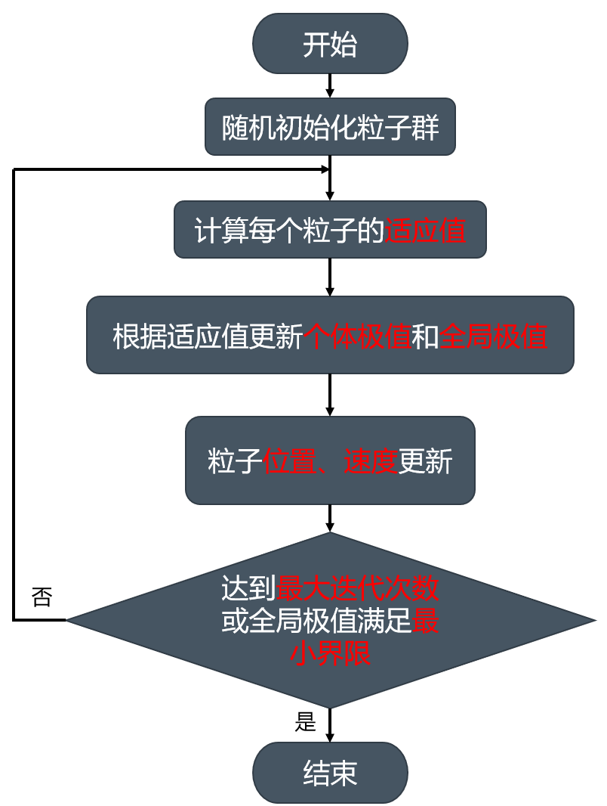
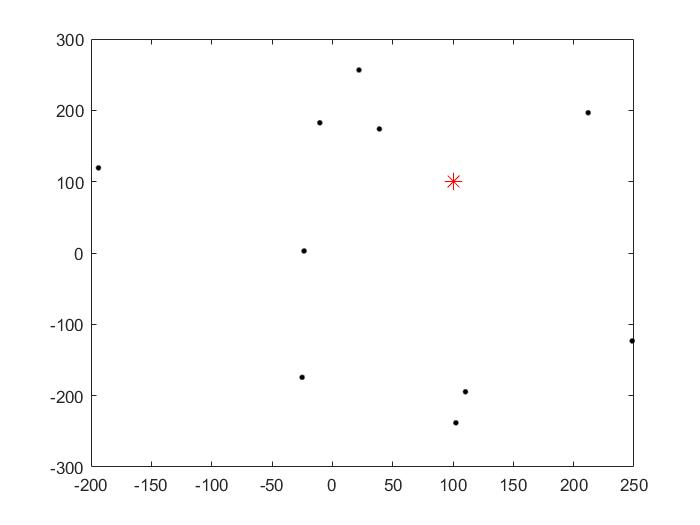
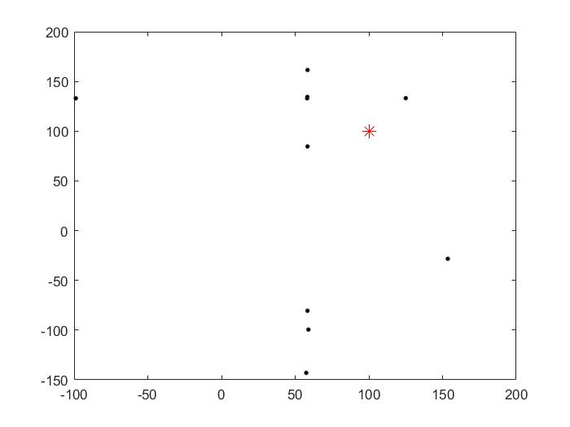
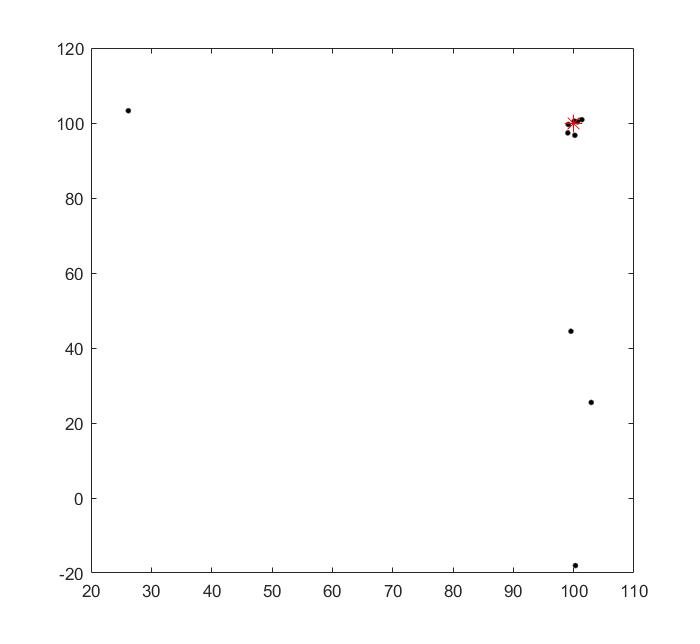

# **1 算法简介**

&emsp;&emsp;它的基本概念源于对鸟群觅食行为的研究。设想这样一个场景：一群鸟在随机搜寻食物，在这个区域里只有一块食物，所有的鸟都不知道食物在哪里，但是它们知道当前的位置离食物还有多远。最简单有效的策略？寻找鸟群中离食物最近的个体来进行搜索。

&emsp;&emsp;粒子群算法采用粒子来模拟上述的鸟类个体，每个粒子可视为N维解（代表问题解的变量个数）的搜索空间中的一个搜索个体，<font color='red'>粒子仅具有两个属性：速度和位置。</font>其<font color='red'>飞行速度</font>可根据粒子<font color='red'>历史最优位置</font>和<font color='red'>种群历史最优位置</font>进行动态调整，其更新公式为：
$$
v_i^{n+1} = wv^n_i + c_1\eta(p_i-x^n_i)+c_2\eta(G-x_i^n)
$$
&emsp;&emsp;其中，i 为N维解中的第 i 维, n 为迭代次数, ω 为惯性权重, η 为 [0,1] 之间的随机数, c1 为个体学习因子,  c2 为群体学习因子，p<sub>i</sub>为个体极值，G为全局极值。

粒子的<font color='red'>当前位置</font>即为对应优化问题的一个<font color='red'>候选解</font>，粒子的飞行过程即为候选解的搜索过程，其更新公式为：
$$
x_i^{n+1} = x_i^n + v_i^n
$$
每个粒子单独搜寻的最优解叫做<font color='red'>个体极值</font>（即粒子自身在当前和历史中离目标最近的位置），粒子群中最优的个体极值作为<font color='red'>全局极值</font>（即粒子群在当前和历史中离目标最近的位置）。采用<font color='red'>适应度</font>作为衡量粒子离全局最优解距离的指标，它的选择由求解问题的数学模型决定。

&emsp;&emsp;<font color='red'>粒子群在迭代过程中，通过计算每个粒子的适应度来更新个体极值和全局极值，通过更新公式来更新每个粒子的速度和位置，最终得到满足终止条件的最优解。</font>

# **2 算法流程图**



# **3 算法示例**

**求解：**(x<sub>1</sub> - 100)<sup>2 </sup>+ (x<sub>2</sub> - 100)<sup>2</sup> = 0

**分析：**这个问题的解可以写作 X = [x<sub>1</sub>，x<sub>2</sub>]，所以粒子的维度是2，选择适应度函数为 f(x) = (x<sub>1</sub> - 100)<sup>2 </sup>+ (x<sub>2</sub> - 100)<sup>2</sup>。

**基于matlab的代码实现：**

```matlab
clc
clear 
close all

%————————————————————————随机初始化粒子群————————————————————————
n=2;					%目标函数的自变量个数
						%定义适应度函数
fitness=inline('(x(1)-100)^2+(x(2)-100)^2','x');
pNum=10;				%粒子群规模
v=2*rand(pNum,n);		%粒子飞翔速度
vMax=5;					%粒子的最大飞翔速度
x=-300+600*rand(pNum,n);%粒子所在位置
w=0.6;					%惯性因子
c1=2;					%每个粒子的个体学习因子，加速度常数
c2=2;					%每个粒子的种群学习因子，加速度常数
maxNum=800;				%最大迭代次数
E=0.01;					%适应度最小值
k=1;					%初始化迭代变量k
%————————————————————————随机初始化粒子群————————————————————————

%—————————————————————初始化个体极值和全局极值————————————————————
for i=1:pNum
	f(i)=fitness(x(i,:));	
end
personalbest_x=x;
personalbest_faval=f;
[globalbest_faval,i]=min(personalbest_faval);
globalbest_x=personalbest_x(i,:); 
%—————————————————————初始化个体极值和全局极值————————————————————

%—————————————————————————打印初始化粒子位置的图像————————————————————————
figure(1);
plot(x(:,1),x(:,2),'k.','MarkerSize',10);
hold on;
plot(100,100,'r*','MarkerSize',10);
hold off;
%—————————————————————————打印初始化粒子位置的图像————————————————————————

%———————————————————————————循环迭代———————————————————————————
while (k<=maxNum)		%判断是否达到最大迭代次数
	for i=1:pNum
			f(i)=fitness(x(i,:));		%计算每个粒子的适应度
		if f(i)<personalbest_faval(i)	%通过比较适应度来更新个体极值
			personalbest_faval(i)=f(i);	
			personalbest_x(i,:)=x(i,:);	
		end
	end
										%选择适应度最小的个体极值作为全局极值
	[globalbest_faval,i]=min(personalbest_faval);
	globalbest_x=personalbest_x(i,:);
    
    for i=1:pNum						%根据更新公式来更新速度和位置
		v(i,:)=w*v(i,:)+c1*rand*(personalbest_x(i,:)-x(i,:))...
			+c2*rand*(globalbest_x-x(i,:));
		for j=1:n
			if v(i,j)>vMax
				v(i,j)=vMax;
			elseif v(i,j)<-vMax
				v(i,j)=-vMax;
            end
		end
		x(i,:)=x(i,:)+v(i,:);
    end
    
    if globalbest_faval<E				%判断是否达到最小适应度（最小误差）
        break
    end
    
	k=k+1;								%迭代次数自增
    
    if mod(k,5)==0						%每迭代5次打印一次粒子位置的图像
        figure(1+k/5);
        plot(x(:,1),x(:,2),'k.','MarkerSize',10);
        hold on;
        plot(100,100,'r*','MarkerSize',10);
        hold off;
    end
end
%———————————————————————————循环迭代———————————————————————————

```

**运行结果：**







