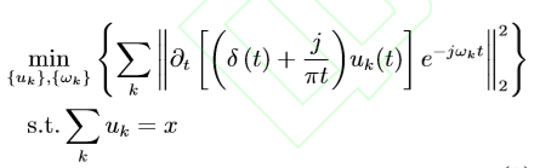
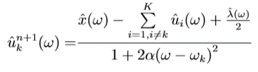
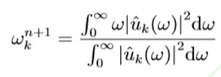
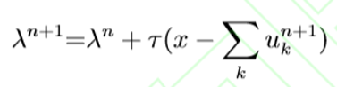
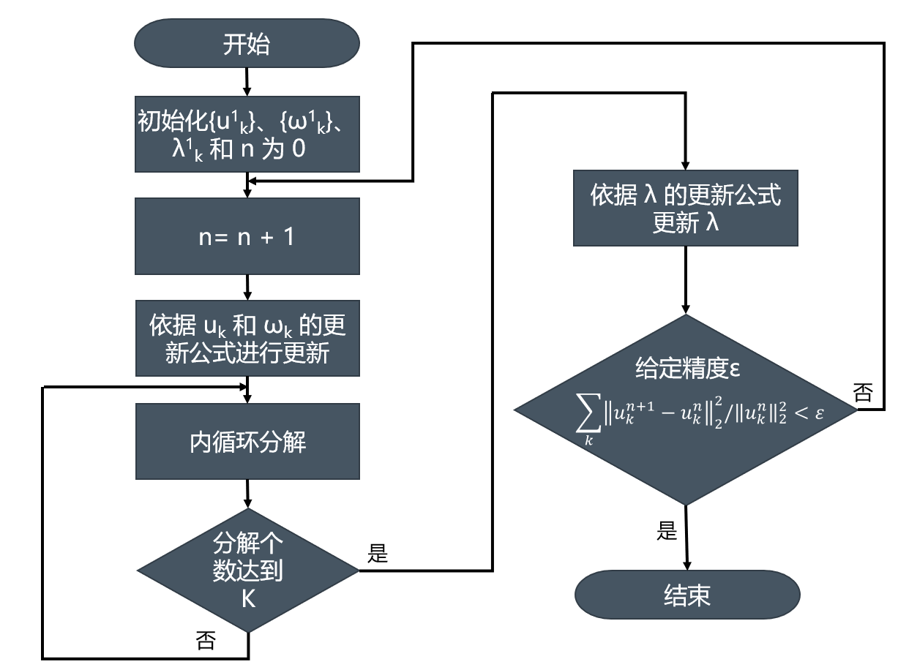
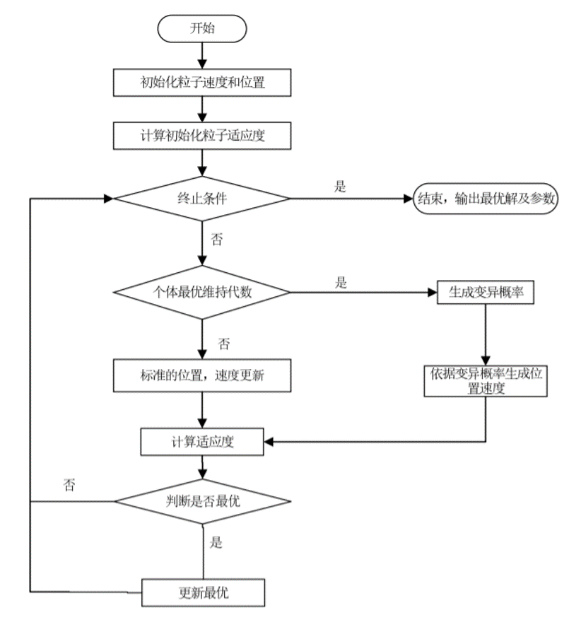
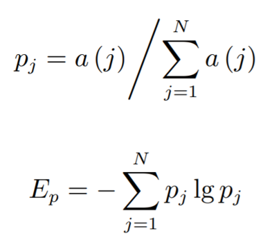
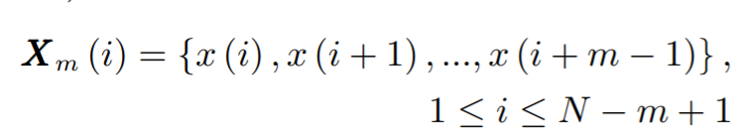
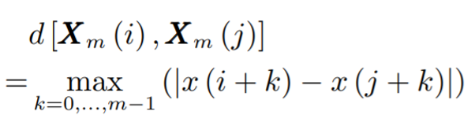

# **1 研究意义**

&emsp;&emsp;滚动轴承是旋转机械设备的关键零件，及时、正确地诊断滚动轴承的状态对整个设备来说至关重要。

**滚动轴承故障诊断的流程：**

&emsp;&emsp;由于设备运行环境噪声的干扰，通过传感器获得的信号包含大量冗余信号，这就需要我们借助信号处理技术去除嘈杂的冗余信号，提取出故障特征，故信号处理和特征提取部分是整个诊断流程的关键。

# **2 研究背景**

- **信号处理：**
  - 经验模态分解(EMD) +Hilbert谱 vs 连续小波变换：诊断正确率有明显提升
  - 局部均值分解(LMD) vs EMD：避免了过包络问题, 减小了模态混淆和端点效应
  - 变分模态分解(VMD) vs EMD/LMD：避免端点效应、抑制模态混淆, 并且具有很高         的分解效率
- **特征提取：**
  - 样本熵是一种度量时间序列复杂度的方法，它衡量当维数变化时时间序列所产生的新模式概率的大小，评判原则为: 时间序列越复杂, 产生新模式的概率就越大, 对应的熵值也越大; 相反, 若时间序列自我相似性越高, 则样本熵值越小。
  - 样本熵运用在机械故障诊断上，取得了较好的效果；但是在借助样本熵量化心脏变异性时间序列的复杂度时, 发现样本熵的评判结果与实际不符, 并根据心脏跳动序列特点提出改进的样本熵, 改进后的样本熵评判结果较为合理。
- **故障诊断：**
  - SVM vs 人工神经网络：在解决小样本和非线性问题中有独特的优势, 已经广泛应用于故障诊断和模式识别等众多领域。

# **3 研究结果**

- **基于研究背景提出存在的问题：**
  - VMD方法的分解效果受限于惩罚因子和分解个数的选择；
  - 样本熵在衡量滚动轴承振动信号的复杂度时具有一定的局限性。

- **作者的改进：**
  - 采用遗传变异粒子群算法进行参数优化；
  - 提出基于滚动轴承故障机理的样本熵算法。

- **总结**

   提出基于参数优化VMD和样本熵的特征提取方法 。

# **4 研究内容**

## **4.1 VMD原理及参数设置**

**VMD的实质：**一个变分问题的构造和求解过程。

（变分问题：有关求泛函的极大值和极小值的问题，泛函：函数的函数，例如弧长公式）

**构造：**

1. 定义了分解后的IMF 分量为调幅−调频 (AM−FM) 信号, 假定原始信号可以分解为 K 个 IMF 分量, 则第 k 个 IMF 分量的表达式如下，其中 k∈{1,···,K}: 
   $$
   u_k(t) = A_k(t)cos[φ_k(t)]
   $$

2. 每个 IMF 分量的带宽可以依据卡森准则估算出来；

3. 在各分量之和等于输入信号的约束条件下，使得各分量的估计带宽之和最小，再经过一系列变换，构造出如下的约束变分模型：

   

4. VMD 方法就是通过搜寻上述约束变分模型的最优解来自适应分解信号，在迭代求解时逐步更新每个分量的中心频率和带宽，最终根据信号自身的频域特性自适应划分出 IMF 分量。

**求解：**

1. 引入二次惩罚因子 α 和拉格朗日算子 λ(t)，将上述约束变分问题转换为如下的非约束变分问题：

   

2. 经过一系列数学运算，得到 xk、ωk 和 λ 的更新公式：

   

   

   

3. VMD 方法分解的具体过程为：

**参数设置对其分解效果的影响**：

1. K 对分解效果的影响：当 K 选择合适时，VMD 方法可以很好地分解出原信号包含的频率成分，但是选择不合适会产生欠分解和过分解现象。
2. α对分解效果的影响：选择不当可能导致分解完成的迭代次数较大，降低分解效率。
3. 总结：α 和 K 的选择会影响 VMD 方法的分解效果, 且参数的选择是不规律的。

## **4.2 基于遗传变异粒子群算法的参数优化**

&emsp;&emsp; 当个体最优保持代数达到maxAge, 采用遗传变异操作更新粒子位置和速度使其跳出局部最优。

**惯性权重ω的选择：**当前迭代次数的惯性权重ω的确定采用Shi提出的线性递减权值方法，公式如下：
$$
w = w_{max} - (w_{max} - w_{min})n/n_{max}
$$
&emsp;&emsp;式中, ωmax 和 ωmin 分别为最大最小惯性权重, n 为当前迭代次数, nmax 为定义的最大迭代次数。

**适应度函数的选择：**在参数优化时,  VMD 方法分解效果的评判标准选用唐贵基等人提出的包络熵 Ep 概念。长度为N的时间信号 x (j) 的包络熵定义为:

&emsp;&emsp;式中, j = 1, 2, ..., N，a (j) 是 x (j) 在 Hilbert 解调后得到的包络信号，pj 是对 a (j) 归一化后的结果，归一化既避免了 IMF 分量不同包络幅值的影响，也减小了微弱噪声的干扰，Ep 是依据信息熵计规则得到，依据 Ep 衡量 VMD 的分解效果。

&emsp;&emsp;滚动轴承的故障信号经过 VMD 方法分解后，若得到分量中包含的噪声较多，则会掩盖故障冲击特征，分量信号的稀疏性较弱，包络熵较大; 相反，若分量中出现规律性的冲击脉冲，信号将会呈现较强的稀疏性，此时计算的包络熵较小。

&emsp;&emsp;合适的选择 α 会降低 VMD 的迭代次数, 即 VMD 方法分解效率更高. 故需要在分解效果最优时, 尽可能达到较高的分解效率, 本文在 min Ep 的基础上, 加入 time (迭代次数), 构建如下的适应度函数：
$$
min F = min E_p + β*time
$$
&emsp;&emsp;式中, β 是适应度函数的量化因子。

## 4.3 基于滚动轴承故障机理的样本熵算法

&emsp;&emsp;样本熵是一种度量时间序列复杂度的方法，它衡量当维数变化时时间序列所产生的新模式概率的大小，评判原则为: 时间序列越复杂，产生新模式的概率就越大，对应的熵值也越大; 相反，若时间序列自我相似性越高，则样本熵值越小。计算样本熵需要确定两个参数，模板匹配长度 m 和阈值 r 。

&emsp;&emsp;通过分析滚动轴承的故障机理知道，轴承部件产生裂纹或者其他损伤时，轴承的啮合尺度会发生变化，导致运行状态发生改变，振动幅值会加剧，损伤部位变化的啮合尺度会使该处的振动幅值异常增大，反映在振动信号的波形中为周期性的冲击幅值，这意味着正常状态时信号的样本熵更小，而故障状态时信号的样本熵更大。

&emsp;&emsp;但是，在借助样本熵衡量滚动轴承运行状态时振动信号的复杂度时, 发现样本熵赋予正常信号更大的熵值，相反，故障状态的熵值更小。

&emsp;&emsp;这与机理分析得出的复杂度不一致，导致样本熵值与振动信号的复杂度不一致的原因可能是阈值 r 的设置，在计算样本熵时，阈值 r 为原始振动信号标准差的 0.1−0.2 倍，由于故障状态下振动信号有周期性冲击幅值，该冲击幅值使阈值 r 变大，则模式匹配时的相似容限变大，模式匹配值变大，计算得出的熵值变小，即故障状态下振动信号的复杂度低， 这种异常增大的阈值 r 忽略了周期性冲击幅值区间内振动信号的波动。

**基于滚动轴承故障机理的样本熵计算过程如下：** 

1. 由原始信号构建 m 维向量：

   

2. 定义向量 Xm(i) 与 Xm(j) 之间的距离 d [ Xm(i) , Xm(j) ] 为两者对应元素中最大差值的绝对值，即：

   

3. 对于给定的 Xm(i)，统计 Xm(i) 与 Xm(j) 之间距离小于等于 r 的  j (1 ≤ j ≤ N − m, j ≠ i) 的数目记为 Bi 。对于 1 ≤ i ≤ N − m，定义:
   $$
   B{_i}{^m}(r) = \frac{1}{N-m-1}B_i
   $$

4. 定义 Bm(r) 为:
   $$
   B^m(r) = \frac{1}{N-m}\sum_{i=1}^{N-m}B_i^m(r)
   $$
   
5. 增加维数到 m + 1，计算 Xm+1(i) 与 Xm+1(j) (1 ≤  j  ≤ N − m, j ≠ i)  距离小于等于 r 的个数，记为Ai，Aim(r)定义为：
   $$
   A^m_i(r) = \frac{1}{N-m-1}A_i
   $$

6. 定义 Am(r) 为:
   $$
   A^m(r) = \frac{1}{N-m}\sum_{i=1}^{N-m}A_i^m(r)
   $$

7. 这样，Bm(r) 是两个序列在相似容限下匹配 m 个点的概率, 而 Am(r)  是两个序列匹配 m + 1 个点的概率，样本熵值为：
   $$
   SampEn(m,r) = \lim_{N\rightarrow\infty}\{-ln[\frac{A^m(r)}{B^m(r)}]\}
   $$

## 4.4 故障诊断

1. 采用遗传变异粒子群算法搜索 VMD 方法的最佳参数组合 [K0, α0]。
2. 采用参数优化 VMD 方法分解原始振动信号得到 IMF 分量。
3. 计算各 IMF 分量的样本熵，最后将样本熵作为特征向量输入SVM 进行故障分类识别。

## 5 结论

&emsp;&emsp;本文提出了基于参数优化 VMD 和样本熵的特征提取方法，借助参数优化的 VMD 方法分解振动信号，对分解后的 IMF 分量求取样本熵，作为特征向量输入SVM，实现滚动轴承的故障诊断识别。

&emsp;&emsp;VMD 方法的分解效果受限于惩罚因子和分解个数的选择，故借助遗传变异粒子群算法进行参数优化。参数优化的 VMD 方法与给定参数设置的 VMD 方法相比，提取的故障特征更为丰富。

&emsp;&emsp;基于滚动轴承故障机理的样本熵算法在衡量振动信号的复杂度时，衡量结果与机理分析的结果一致，有利于对轴承状 态的诊断判别。

&emsp;&emsp;仿真实验表明，采用参数优化 VMD 和样本熵的特征提取方法，滚动轴承的故障诊断准确率有明显的提高。