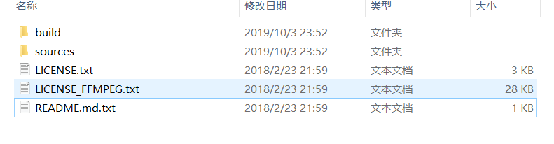
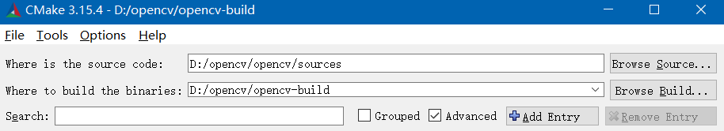
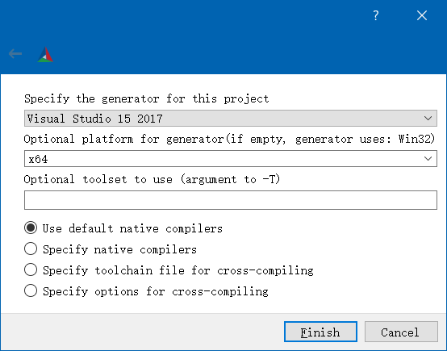
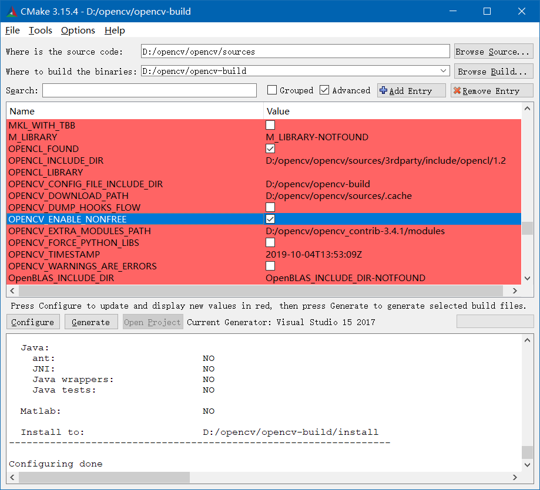
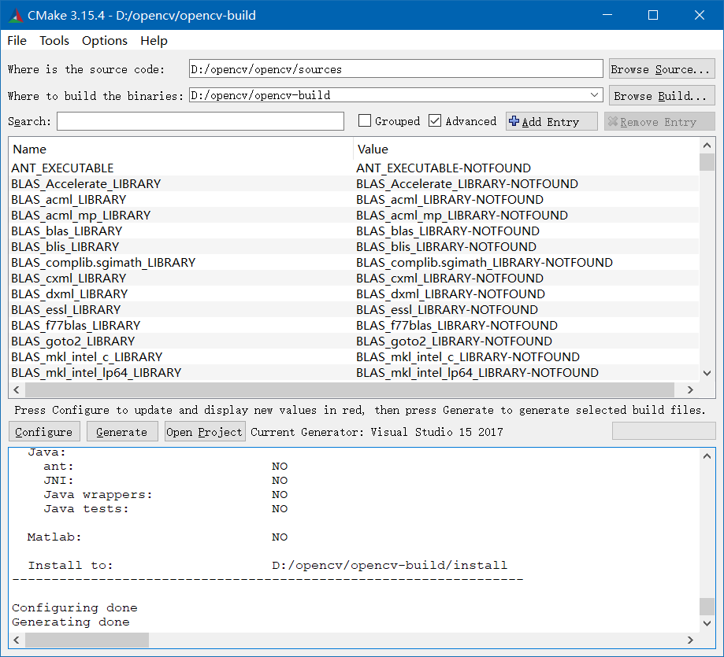
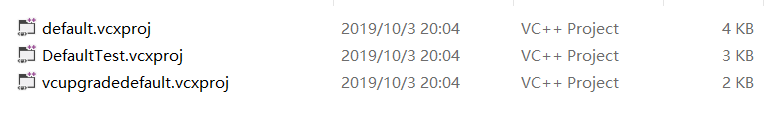
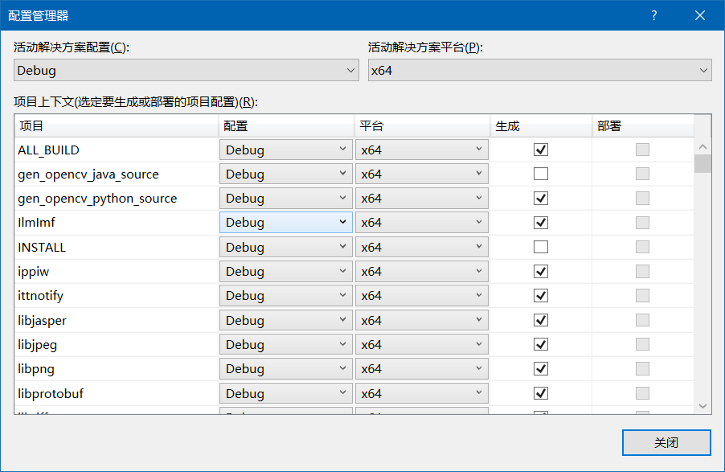
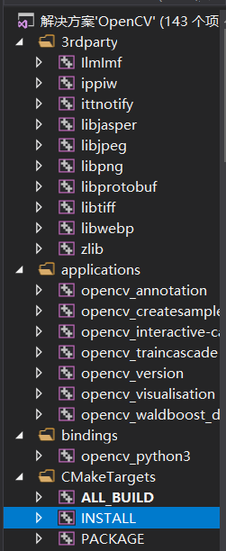

# **1 准备材料**

- **运行环境：win10(x64)**
- [opencv3.4.1 windows 安装包](https://opencv.org/releases/page/2/)
- [opencv-contrib3.4.1](https://github.com/opencv/opencv_contrib/tree/3.4.1)
- VS2017（微信关注“菜鸟软件网”可以找到网盘下载）
- [CMake](https://github.com/Kitware/CMake/releases/download/v3.15.4/cmake-3.15.4-win64-x64.msi)
- (可选)CMake 编译过程中可能用到的组件
  - [CMake_Opencv_Component_1](https://github.com/fairytail655/CMake_Opencv_Component_1.git)
  - [CMake_Opencv_Component_2](https://github.com/fairytail655/CMake_Opencv_Component_2.git)

# **2 用CMake编译Opencv**

1. 安装好 CMake；

2. 新建文件夹 opencv-all，将 opencv（勾选添加PATH）安装进去，也将opencv_contrib3.4.1解压到该文件夹中，并新建文件夹 opencv-build，所以 opencv-all 下有三个文件夹；

3.  opencv 的安装目录如下图所示：

   

   &emsp;&emsp;其中，build\x64\vc14 / vc15 分别对应着 VS2015/VS2017 版本编译好的的 opencv 链接库，但是并不推荐使用，因为从 opencv3 开始默认安装的编译版本里缺少opencv_contrib里的模块。

4.  打开 CMake 如下图所示：

   

5. 设置 Where is 为 opencv 安装目录下 sources文件夹，设置 Where to 为 opencv-build，勾选上 Adcanced，点击 configure 出现如下图所示：

   

6. 按照上图进行配置，点击 Finish 开始运行，中间会下载一些文件 （如：FFMPEG: Download: opencv_ffmpeg.dll等，如果网不好的话要等很久并下载失败报错，不过不要紧，待会可以查看下载日志手动下载），完成后会出现下图一大片红色情况：

   

7. 如果有下载失败的组件，可以从 opencv-contrib\CMakeDownloadLog 中找到相应的下载地址（或者到博客开头第1节的准备材料下载），然后自己手动下载后放置到 opencv\sources\\.cache 对应的文件夹中。找到图中 OPENCV_ENABLE_NONFREE 并勾选，同时将下面的路径填上，为 opencv-contrib 下的 modules 文件夹，再次点击 configure，程序再次运行，中间可能会下载一些文件，耐心等待完成后，还是会出现一大片红色，如果有下载失败的组件，可以重复上述步骤，然后再次点 configure，这次运行很快，红色会消失，最后点击 generate，运行完成后关闭CMake，结果如下图所示。

   

# **3 用VS2017获取链接库**

1. 安装好 VS2017(具有C++编译功能即可)；

2. 下面需要将 VS2017 的活动解决方案平台设置为 x64，打开文件夹 C:\Program Files (x86)\Microsoft Visual Studio\2017\Enterprise\Common7\IDE\VC\VCWizards，将下图所示的3个文件备份，然后复制到桌面用记事本打开，通过查找替换将所有的 Win32 替换为 x64，再复制到原文件夹中覆盖即可；

   

3. 打开 VS2017，点击 Debug 的下拉键，选择配置管理器，新建活动方案解决平台为 x64，如下图所示，完成后关闭 VS；

   

4. 打开 VS 解决方案 opencv-build/OpenCV.sln，确认活动方案解决平台为 x64，确认该文件夹所在磁盘有足够大的空间（10G以上），点击 “生成 -> 生成解决方案”，然后需要等待很长时间，运行结果应该显示为绝大多数成功，可能会有1个失败。

5. 右键点击 INSTALL 这个文件（如下图所示），选择 “仅用于项目 -> 仅生成 INSTALL”，然后 opencv-build 中会出现 install 文件夹，它就是我们需要的链接库文件夹，将它复制出去，opencv-build 就可以删除了。

   
   
6. 最后，要将 install\x64\vc15\bin 和 install\x64\vc15\lib 添加到系统的 PATH 中，否则调用可能会出现缺少依赖库的情况。