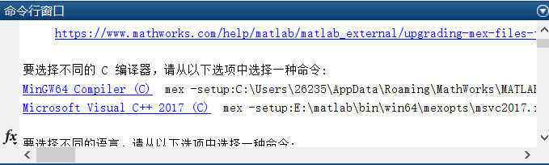
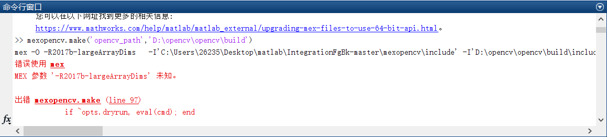
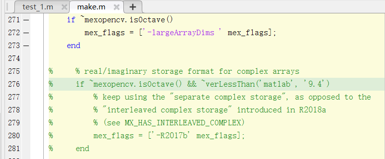
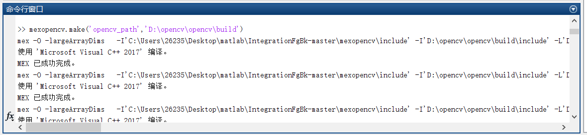
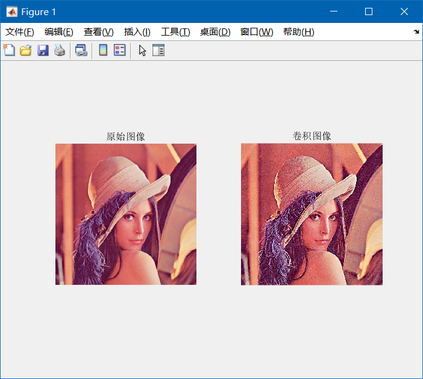

# **1 准备材料**

- matlab R2019a（微信关注“菜鸟软件网”可以找到网盘下载）
- VS2017（微信关注“菜鸟软件网”可以找到网盘下载）
- VS2017编译的opencv链接库“install” (版本必须是3.4.1，获取方式请见https://fairytail655.github.io/2019/10/04/191004-2/)
- [mexopencv 3.4.1](https://github.com/kyamagu/mexopencv/archive/master.zip)


# **2 执行步骤**

1. <font color="red">首先安装好 matlab 和 visual studio</font>；

2. 将 mexopencv 解压到 matlab 工作目录下（或者用 addpath() 添加其路径到工作目录 ）；

3. 在 matlab 命令行执行 <font color="red">mex -setup</font>；

4. 显示情况如下图所示：

   

5. 选择后者 <font color="red">VS2017</font> 作为编译器；

6. 然后在 matlab 命令行执行 <font color="red">mexopencv.make('opencv_path','D:\opencv\install')</font>（第二个参数的路径为“VS2017编译的opencv链接库 install 的路径”）；

7. 显示情况（链接库名称不一样）如下图所示：

   

8. 点击错误提示，到达报错的文件内，在 <font color="red">275-281</font> 行找到如下代码，并注释掉：

   

9. 再次执行 <font color="red">mexopencv.make('opencv_path','D:\opencv\install')</font>，提示如下信息并开始读条（持续时间时间较长）：

   
   
10. 结束后，执行 <font color="red">cv.getBuildInformation()</font> 出现如下信息即为配置成功。

    General configuration for OpenCV 3.4.1 =====================================
      Version control:               3.4.1

      Platform:
        Timestamp:                   2018-02-23T13:47:28Z
        Host:                        Windows 10.0.16299 AMD64
        CMake:                       3.9.3
        CMake generator:             Visual Studio 15 2017 Win64
        CMake build tool:            C:\Program Files (x86)\Microsoft Visual Studio\2017\Professional/MSBuild/15.0/Bin/MSBuild.exe
        MSVC:                        1912

      CPU/HW features:
        Baseline:                    SSE SSE2 SSE3
          requested:                 SSE3
        Dispatched code generation:  SSE4_1 SSE4_2 FP16 AVX AVX2
          requested:                 SSE4_1 SSE4_2 AVX FP16 AVX2 AVX512_SKX
          SSE4_1 (3 files):          + SSSE3 SSE4_1
          SSE4_2 (1 files):          + SSSE3 SSE4_1 POPCNT SSE4_2
          FP16 (1 files):            + SSSE3 SSE4_1 POPCNT SSE4_2 FP16 AVX
          AVX (5 files):             + SSSE3 SSE4_1 POPCNT SSE4_2 AVX
          AVX2 (9 files):            + SSSE3 SSE4_1 POPCNT SSE4_2 FP16 FMA3 AVX AVX2

      C/C++:
        Built as dynamic libs?:      YES
        C++11:                       YES
        C++ Compiler:                C:/Program Files (x86)/Microsoft Visual Studio/2017/Professional/VC/Tools/MSVC/14.12.25827/bin/Hostx86/x64/cl.exe  (ver 19.12.25835.0)
        C++ flags (Release):         /DWIN32 /D_WINDOWS /W4 /GR  /D _CRT_SECURE_NO_DEPRECATE /D _CRT_NONSTDC_NO_DEPRECATE /D _SCL_SECURE_NO_WARNINGS /Gy /bigobj /Oi      /EHa /wd4127 /wd4251 /wd4324 /wd4275 /wd4512 /wd4589 /MP8   /MD /O2 /Ob2 /DNDEBUG 
        C++ flags (Debug):           /DWIN32 /D_WINDOWS /W4 /GR  /D _CRT_SECURE_NO_DEPRECATE /D _CRT_NONSTDC_NO_DEPRECATE /D _SCL_SECURE_NO_WARNINGS /Gy /bigobj /Oi      /EHa /wd4127 /wd4251 /wd4324 /wd4275 /wd4512 /wd4589 /MP8   /MDd /Zi /Ob0 /Od /RTC1 
        C Compiler:                  C:/Program Files (x86)/Microsoft Visual Studio/2017/Professional/VC/Tools/MSVC/14.12.25827/bin/Hostx86/x64/cl.exe
        C flags (Release):           /DWIN32 /D_WINDOWS /W3  /D _CRT_SECURE_NO_DEPRECATE /D _CRT_NONSTDC_NO_DEPRECATE /D _SCL_SECURE_NO_WARNINGS /Gy /bigobj /Oi        /MP8    /MD /O2 /Ob2 /DNDEBUG 
        C flags (Debug):             /DWIN32 /D_WINDOWS /W3  /D _CRT_SECURE_NO_DEPRECATE /D _CRT_NONSTDC_NO_DEPRECATE /D _SCL_SECURE_NO_WARNINGS /Gy /bigobj /Oi        /MP8  /MDd /Zi /Ob0 /Od /RTC1 
        Linker flags (Release):      /machine:x64  /INCREMENTAL:NO 
        Linker flags (Debug):        /machine:x64  /debug /INCREMENTAL 
        ccache:                      NO
        Precompiled headers:         NO
        Extra dependencies:
        3rdparty dependencies:

      OpenCV modules:
        To be built:                 calib3d core dnn features2d flann highgui imgcodecs imgproc java_bindings_generator ml objdetect photo python_bindings_generator shape stitching superres video videoio videostab world
        Disabled:                    js python2 python3
        Disabled by dependency:      -
        Unavailable:                 cudaarithm cudabgsegm cudacodec cudafeatures2d cudafilters cudaimgproc cudalegacy cudaobjdetect cudaoptflow cudastereo cudawarping cudev java ts viz
        Applications:                apps
        Documentation:               NO
        Non-free algorithms:         NO

      Windows RT support:            NO

      GUI: 
        Win32 UI:                    YES
        VTK support:                 NO

      Media I/O: 
        ZLib:                        build (ver 1.2.11)
        JPEG:                        build (ver 90)
        WEBP:                        build (ver encoder: 0x020e)
        PNG:                         build (ver 1.6.34)
        TIFF:                        build (ver 42 - 4.0.9)
        JPEG 2000:                   build (ver 1.900.1)
        OpenEXR:                     build (ver 1.7.1)

      Video I/O:
        Video for Windows:           YES
        DC1394:                      NO
        FFMPEG:                      YES (prebuilt binaries)
          avcodec:                   YES (ver 57.107.100)
          avformat:                  YES (ver 57.83.100)
          avutil:                    YES (ver 55.78.100)
          swscale:                   YES (ver 4.8.100)
          avresample:                YES (ver 3.7.0)
        GStreamer:                   NO
        DirectShow:                  YES

      Parallel framework:            Concurrency

      Trace:                         YES (with Intel ITT)

      Other third-party libraries:
        Intel IPP:                   2017.0.3 [2017.0.3]
               at:                   C:/build/master_winpack-build-win64-vc15/build/3rdparty/ippicv/ippicv_win
        Intel IPP IW:                sources (2017.0.3)
                  at:                C:/build/master_winpack-build-win64-vc15/build/3rdparty/ippicv/ippiw_win
        Eigen:                       NO
        Custom HAL:                  NO
        Protobuf:                    build (3.5.1)

      OpenCL:                        YES (no extra features)
        Include path:                C:/build/master_winpack-build-win64-vc15/opencv/3rdparty/include/opencl/1.2
        Link libraries:              Dynamic load

      Python (for build):            C:/utils/soft/python27-x64/python.exe

      Java:                          
        ant:                         C:/utils/soft/apache-ant-1.9.7/bin/ant.bat (ver 1.9.7)
        JNI:                         C:/Program Files/Java/jdk1.8.0_112/include C:/Program Files/Java/jdk1.8.0_112/include/win32 C:/Program Files/Java/jdk1.8.0_112/include
        Java wrappers:               NO
        Java tests:                  NO

      Matlab:                        NO

      Install to:                    C:/build/master_winpack-build-win64-vc15/install


# **3 测试**

&emsp;&emsp;新建脚本文件，输入如下代码并运行：

```matlab
im = imread('Lena.jpg');
kern = [0 -1 0;-1 5 -1;0 -1 0];
result = cv.filter2D(im, kern);
subplot(1,2,1);
imshow(im);title('原始图像');
subplot(1,2,2);
imshow(result);title('卷积图像');

```

**&emsp;&emsp;运行结果如图：**

