# **1 研究意义**

&emsp;&emsp;背景减法是计算机视觉的一个基本任务，它的应用范围广泛，例如视频监控、光学运动捕捉和多媒体应用。该任务旨在将任意像素点分成两类，其中，前景类代表运动物体，背景类代表背景场面。传统上假设通过一个静止的相机来捕捉视频序列，在这种假设下，运动物体成为唯一的运动源，并导致像素强度的变化。在以前的方法中，通过使用统计模型（如高斯混合模型）分析变化来减去背景，然而，在自由运动相机捕获的画面中，背景中的像素不再保持它们各自的位置。此时，背景表现为另一个运动源，导致给定像素出现不规则的观测值，这些不规则的变化使得所提出的基于静止相机的算法失效，从而对背景减法问题提出了新的挑战。

# **2 研究背景**

&emsp;&emsp;近年来，人们提出了许多巧妙的算法来检测使用自由移动相机时的移动目标，在接下来的三部分简要讨论了这些算法。首先，在 2.1 节对基于时空特征的算法进行了综述，然后在 2.2 节讨论了基于几何约束的算法。最后，由于超像素用于聚合，所以在 2.3 节讨论了基于超像素的算法。

## **2.1 基于时空特征的算法**

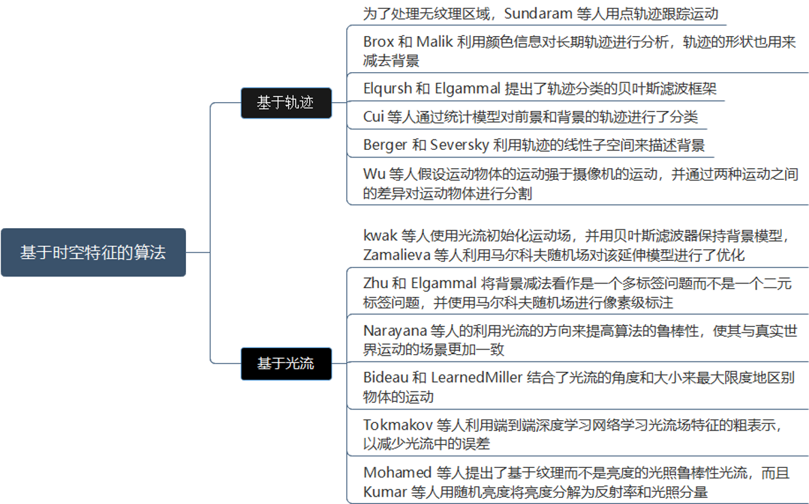

&emsp;&emsp;但是，由于自然场景的多样性，这些方法在如此复杂的自然场景中表现得并不令人满意。此外，计算成本是光流的另一个缺陷，即使借助近年来与深度学习相关的先进技术，在各种复杂的自然场景中准确捕捉光流仍然是一项颇具挑战性的任务。因此，由于运动物体的不可预测性，运动物体可能产生类似于相机的运动模式。在这种情况下，无论是轨迹还是光流方法都不能正确地标示出运动相机的前景，因此也不能在复杂的场景或从一个快速移动相机获得地视频中工作。

## **2.2 基于几何约束的算法**

&emsp;&emsp;由于相机运动导致传统的算法失效，很多算法使用基于几何约束的算法来消除相机的运动。

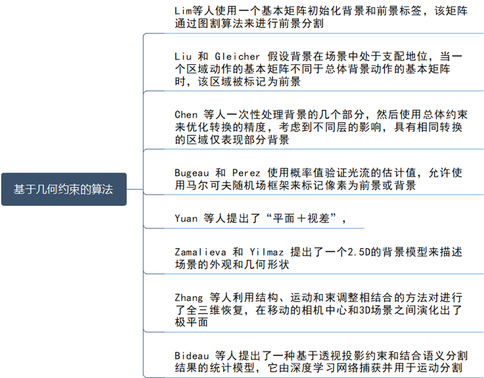

&emsp;&emsp;在几何约束的作用下，运动物体是像素变化的唯一来源。在之前的几种方法中，通过统计模型分析像素变化来分割前景，然而，这些前景包含了大量的噪音。

# **3 研究结果**

&emsp;&emsp;对于自由运动相机，前景和背景的运动重叠，因此很难做出准确的估计，此外，自然场景的复杂性也增添了挑战。所以作者通过研究发现，使用可选线索的聚合作为解决方案，不需要进行精确的运动估计。如下图所示，由于自然场景的复杂性，前景线索不仅显示在运动目标上，还出现在像图中 R 区域这样确定的背景部分。通常，这些摆动的树被错误地检测为运动目标，但是，得益于背景线索的贡献，这些线索的聚合抵消了这些错误，从而产生了一个有效的运动物体的二进制掩膜。受这些见解的启发，作者将注意力集中在聚合可选线索而不是提高运动估计的准确性上，并提出了一种基于前景和背景线索聚合（IFB）的新框架，用于自由运动相机中的背景减法。

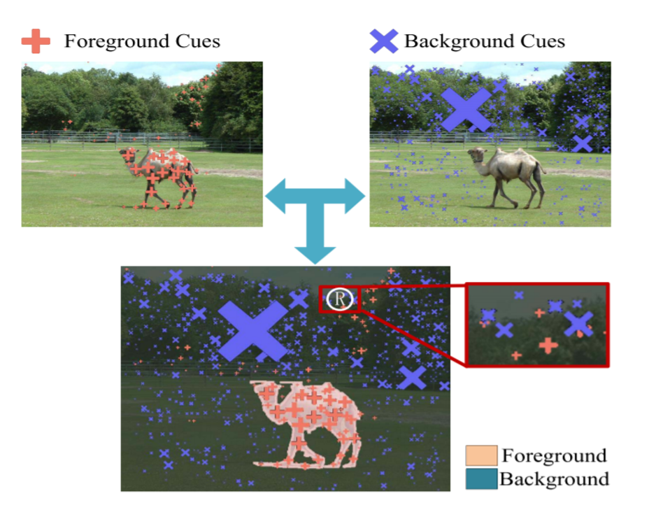

**总结：**

1. 提出了一种新的 IFB框架来实现自由运动相机的背景减影。与之前的例子不同，在这里，IFB 模型关注的是融合不同的前景和背景线索，而不是提高运动估计的准确性。由于它们的互斥性，这两种线索可以同时使用来弥补各自的缺陷。
2. 通过一个基于背景图像和当前帧的几何约束的图像对齐，延伸了 GMM(高斯混合模型) 来提取前景线索。
3. 提出了一种基于时空特征的背景线索提取方法。利用图像序列的单应性变换估计时空特征的运动，并将具有相同的相机运动的特征作为背景线索。
4. 将这些线索在多个层次的超像素中进行整合，提高了 IFB 模型的效率和精度。

# **4 研究内容**

**IFB 框架**

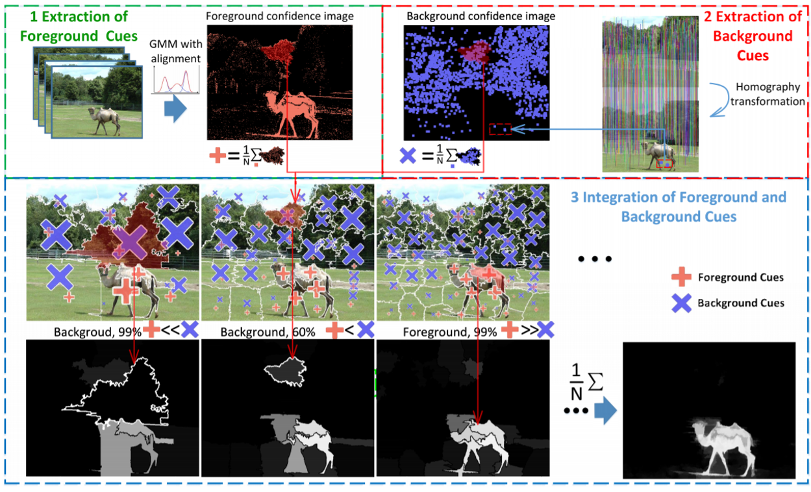

## **4.1 前景线索提取**

&emsp;&emsp;前景线索被定义为作为前景在超像素的邻近度，它是由一个特定的超像素所包含的前景置信值的平均值来提取的，如下所示:

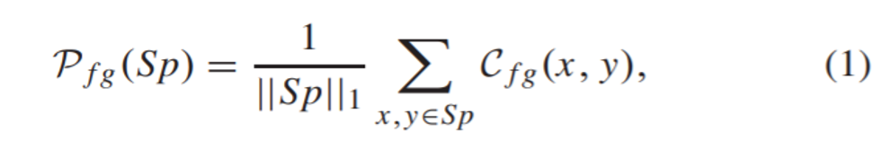

&emsp;&emsp;其中 Pfg(Sp) 为前景线索，Cfg(x, y) 为像素在位置 (x, y) 的置信值，||Sp||1 为超像素 Sp 中包含的像素个数。

&emsp;&emsp;前景置信度图像 Cfg 保留当前帧像素的置信度值，然后采用高斯混合模型(GMM)对前景置信度图像进行帧对齐步骤补偿。虽然对齐步骤不足以完美地抵消摄像机的运动，但对于生成提取线索的粗糙置信图像是足够的。GMM 是一种经典的基于像素的静态相机背景减法的统计方法，它通过多重高斯函数逼近像素强度的变化，然后将其与权值相结合。

&emsp;&emsp;将位于 (x’ , y’) 上像素的 GMM 表示为：
$$
G(x',y')=\{\omega_k(x',y'),\theta_k(x',y') | k\in[1 K]\}
$$
&emsp;&emsp;其中，ω 和 θ 分别代表每个高斯函数的权重和参数，k 是高斯函数的索引，K是高斯函数的个数。

&emsp;&emsp;静止相机拍摄的视频中，像素的位置保持不变。因此，位于之前帧 (x’，y’) 的GMM直接用于当前帧相同位置的像素上。然而，在自由移动摄像机拍摄的视频中，像素不再保持它们的位置，即使在连续的两帧中也是如此。为了将 GMM 扩展到可自由移动的摄像机中来捕捉像素强度 I(x, y) 的置信度，最后一帧中的每个模型 G (x’ , y’) 通过图像对齐变换到当前帧的对应位置 (x, y)，如下所示:
$$
C_{fg}(x,y)=\sum_{k=1}^{K}\omega_k(x',y')\phi(I(x,y)|\theta_k(x',y'))
$$
&emsp;&emsp;其中，Cfg(x, y) 是前景置信图像 Cfg 中保存的置信值，Φ 是高斯函数，θ={μ、σ} 代表高斯函数的均值和方差。

&emsp;&emsp;通过一个单应性矩阵 Hbk = [h1 h2 h3] T 来描述像素 (x , y) 与 GMM 的 (x’ , y’) 位置之间的转换，如下所示：
$$
\left[ \begin{array}{cc}\lambda{x} \\ \lambda{y} \\ \lambda \end{array} \right ] = H_{bk}\cdot \left[ \begin{array}{cc}{x'} \\ {y'} \\ 1 \end{array} \right ] = \left[ \begin{array}{cc}{\overrightarrow{h_1}} \\ \overrightarrow{h_2} \\ \overrightarrow{h_3} \end{array} \right ] \cdot \left[ \begin{array}{cc}{x'} \\ {y'} \\ 1 \end{array} \right ]
$$
&emsp;&emsp;通过上式的分解得到 (x , y) 和 (x’ , y’) 之间的转换步骤，如下所示：

&emsp;&emsp;其中，trx() 和 try() 为转换函数，它们将 GMM 模型的 (x’ , y’) 位置转换到当前帧像素对应的位置 (x, y)，单应性矩阵 Hbk 由式10得到。关于矩阵 Hbk 的细节将在后面解释，因为它是在捕获背景线索的过程中得到的。利用式 4 和式 5 将前一帧位置的 GMM 模型转换为当前帧的对应位置。其中，转换到不可能位置的模型被丢弃，并为这些位置创建新的 GMM 模型，而不需要转换任何 GMM 模型。为了将这些模型成功地转换到当前帧的新位置，对其进行更新以适应环境的变化，如下所示：

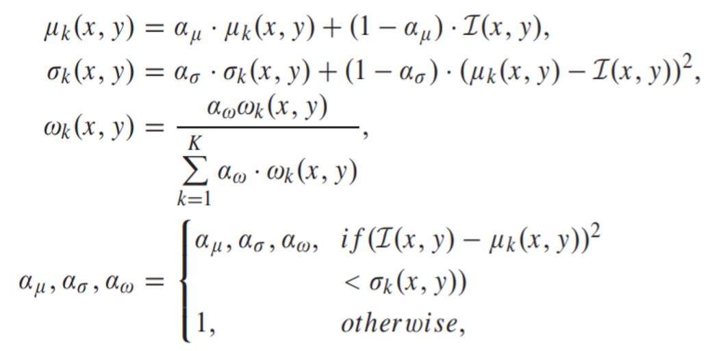

&emsp;&emsp;其中，αμ, ασ, αω 用于参数更新，K 是高斯函数的个数，在实验中，GMM 是自实现的，所有的实验都使用默认的参数来强调 IFB 框架的效率，而不是仅仅用于提取前景线索的 GMM 模型。采用 {αμ, ασ, αω} = { 0.99, 0.99, 1.05 }，K = 3。此外，视频的第一帧被用于初始化 GMM 以获取初始线索。

**总结：**

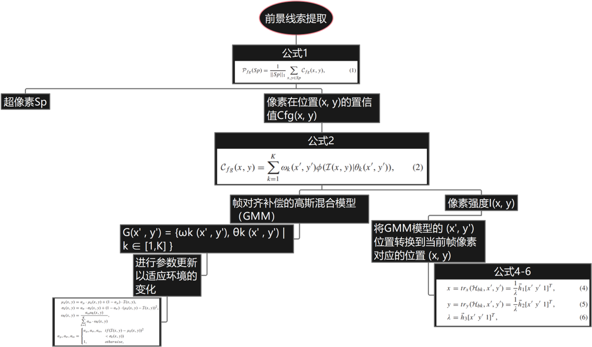

## **4.2 背景线索提取**

&emsp;&emsp;与前景线索的定义类似，背景线索被定义为作为背景的超像素的邻近度。然而，因为整合被设计为前景和背景线索之间的竞争，其中的线索必须相互独立的竞争，所以背景线索的提取是独立于前景线索的提取的。通过保存在背景置信度图片中置信值的均值来提取背景线索，如下所示：

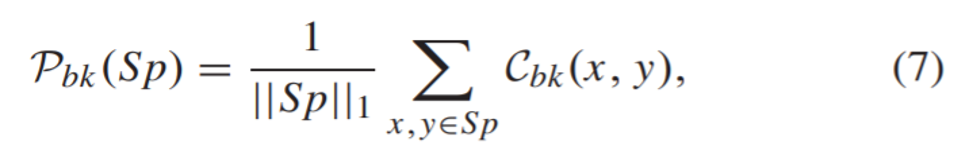

&emsp;&emsp;其中，Pbk(Sp) 是超像素 Sp 的背景线索，Cbk (x, y) 是位于 (x, y) 像素的背景置信值。

&emsp;&emsp;与前景置信图像用于保留扩展高斯混合模型捕捉到的邻近度不同，背景置信图像保留了被认为位于背景中的时空特征关键点。然而，传统的背景假设，即场景的静态部分，在移动摄像机获得的帧中是无效的，因此对象的位置不同使得静态部分不存在。为了解决这个问题，作者假设大部分相对静态的部分是背景。特别是利用时空特征来描述场景的不同部分，将具有相同运动估计的特征识别为相对静态的特征。在此假设下，背景是包含相对静态时空特征数量最多的部分，利用背景置信度图像来保存这些时空特征的位置。根据当前帧和背景图像之间的差异来识别和捕获背景置信度图像。背景图像 Ibk 是没有运动物体的图像，是 GMM 模型的表示，通过具有最大权重的高斯函数的均值 μ 直接获得背景图像中的像素强度，如下所示：

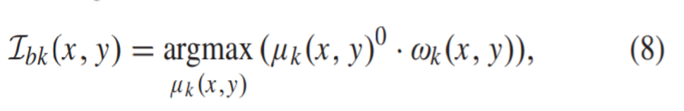

&emsp;&emsp;其中，μk (x, y) 和 ωk (x, y) 是 (x, y) 处高斯函数的均值和权重。

&emsp;&emsp;接下来，将当前帧和背景图像中得到的时空特征分别表示为 {f1, f2，…fM} 和 { f1, f2，…fM}，其中 M 和 M’ 是特性的数目。通常，每个时空特征至少包含两个成分，关键点的描述符 h 和位置 (x, y)。对这些特征的描述符进行交叉匹配，以找到当前帧和背景图像之间的公共部分。特别地，采用欧氏距离的平方来匹配，将 ε 表示为匹配的时空特征对集合，定义如下：

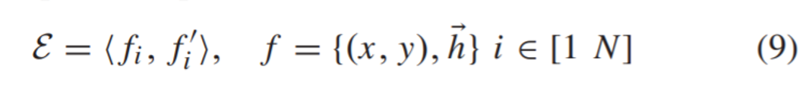

&emsp;&emsp;其中，i 是共有部分特征的索引，N 是共有部分的数目。在实验中，采用 SIFT (尺度不变特征变换) 、SURF(加速鲁棒特征) 和 KAZE 特征被用做输入的时空特性的例子，以此展现不同特征输入下 IFB 框架的有效性。

&emsp;&emsp;如前所述，背景被定义为包含了最多数量的时空特征，这些特征遵循用于描述背景运动的变换矩阵。将背景运动的变换矩阵表示为 Hbk，它的数学表达式如下：

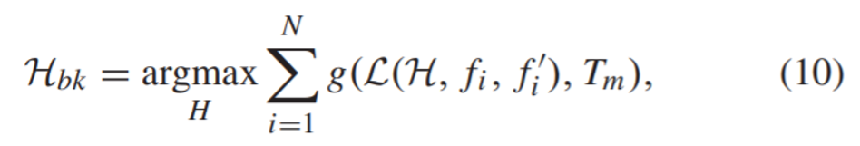

&emsp;&emsp;其中，用 g(L(H, fi, fi’), Tm) 判断 fi 与 fi’ 之间的变换是否在阈值 Tm 所描述的误差范围内跟随矩阵 H，g(x, y)是一个分段函数：

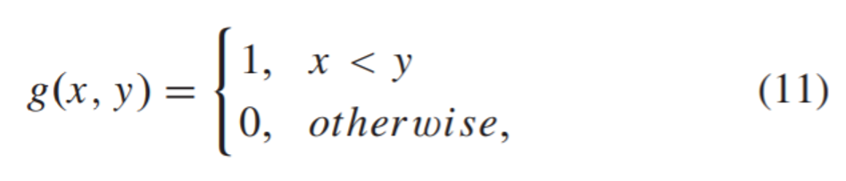

&emsp;&emsp;L() 是通过矩阵 H = [h1 h2 h3]T 将背景图像中特征 fi’ 的位置变换为当前帧中特征 fi 的对应位置时，用于误差评估的损失函数。L() 的定义如下：

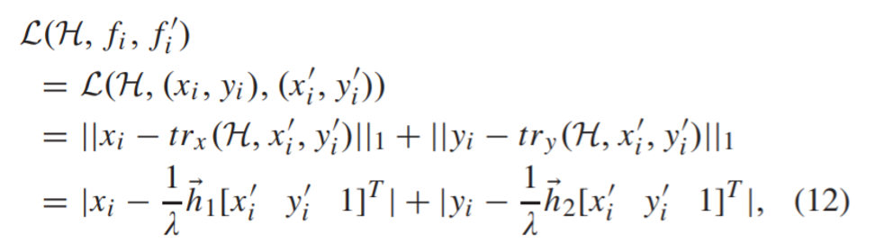

&emsp;&emsp;其中，trx 和 try 分别为式 4 和式 5 所示的变换函数，(xi, yi) 和 (xi’, yi’) 分别是特征fi 和 fi’ 的关键点的位置，λ 的定义在式 6。

&emsp;&emsp;为了获取 Hbk，采用单应性变换和 RANSAC (随机采样一致算法)，这里简要介绍下通过单应性变换和 RANSAC 获取 Hbk 的方法。由于单应性变换的性质，ε 中的 4 对特征(如式 9 所示)主要需要获取一个单应性矩阵 H，用 {(xi, yi) , (xi’ , yi’) | i ∈ [1 N], N ≥ 4} 来表示这些特征对中关键点的位置。首先，获取每个位置的斜对称矩阵如下：

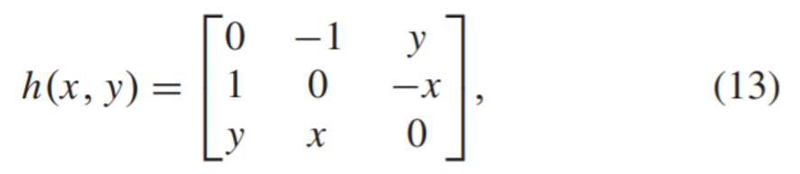

&emsp;&emsp;然后，这些斜对称矩阵组合如下:

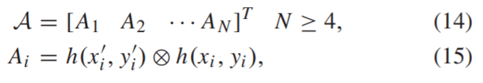

&emsp;&emsp;其中，⊗ 表示克罗内克积，(xi, yi) 和 (xi’ , yi’) 分别是 ε 中各条目的位置，也是当前帧和背景图像中各关键点的位置。最后，矩阵 A 的奇异值分解(SVD)结果为 4 个位置间的单应性矩阵的解，如下所示：

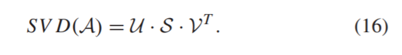

&emsp;&emsp;在 RANSAC 算法中，选择的数目固定为 400，这是 RANSAC 的默认参数。跟随背景运动的 ε 中的特征被认为是背景的一部分，其位置被保留在背景置信度图像中，如下所示：

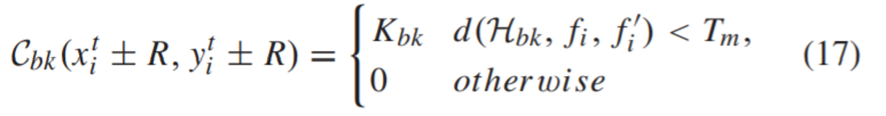

&emsp;&emsp;其中，Cbk 是背景置信图像，R 是关键点的半径，Kbk 是表示点贡献度的常量，由于关键点是不可见的，为了使点的观察更加清晰，我们简单地将点更改为一个矩形，R 是边的长度，在这些实验中，R 固定为 5。

**总结：**

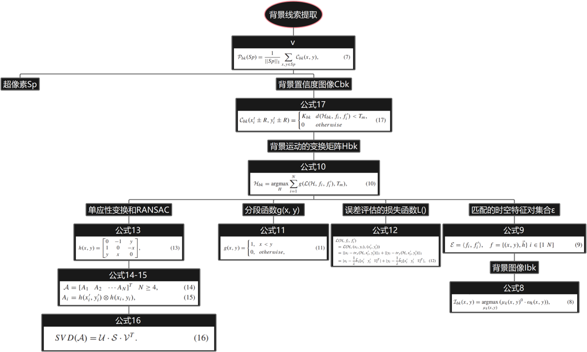

## **4.3 前景和背景线索的聚合**

&emsp;&emsp;影响 IFB 模型效果的主要因素是前景线索和背景线索之间的排他性，因为一种线索中存在的任何缺陷都会被另一种线索抵消。基于这种动机，整合被设计成一个前景线索和背景线索竞争的过程，竞争结果被用来作为属于前景或背景的超像素的邻近度。然后，在一个特定的层次上，产生一个由这些具有邻近度的超像素组成的邻近度图像。随后，在多个层次上对多个邻近度图像进行分层捕获。最后，对这些邻近度图像取均值，将其与阈值进行比较来分割移动对象。然而，在自由移动摄像机获取的视频中，用于提取背景线索的 Cbk 中保存的关键点数量并没有保持不变，因为时空特征的数量是随着背景场景的变化而变化的。相反，由于前景置信度图像是从每个像素建立的 GMM 模型中获取的，因此受场景变化的影响较小。为了处理 Cfg 和 Cbk 之间的不平衡，根据采集到的前景置信图像  Cfg 调整 Cbk 中保留的置信值，如下所示：

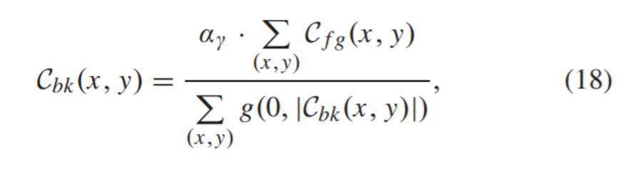

&emsp;&emsp;其中，αγ 控制背景线索贡献度的参数，Cfg 和 Cbk 分别为前景置信度图像和背景置信度图像，g() 是一个分段函数，已在式 11 中定义。利用几何级数来控制超像素的数量，让我们表示超像素在多个层次的数量为：{ αβ * 2j | j∈[0 J] }，这些数字控制的超像素如下所示：

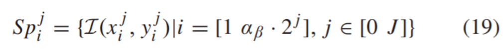

&emsp;&emsp;其中，j 是层次的索引，i 是 j 层下的超像素的索引，J 是控制层次数量的用户参数，点 (xij , yij) 表示构成超像素 Spij 的像素的位置。

&emsp;&emsp;对于每个超像素，将前景线索与背景线索进行竞争，获取超像素是作为前景还是作为背景的邻近度，分别从式 2 和式 17 的置信度均值中提取前景线索和背景线索。竞争过程的数学表达式如下：

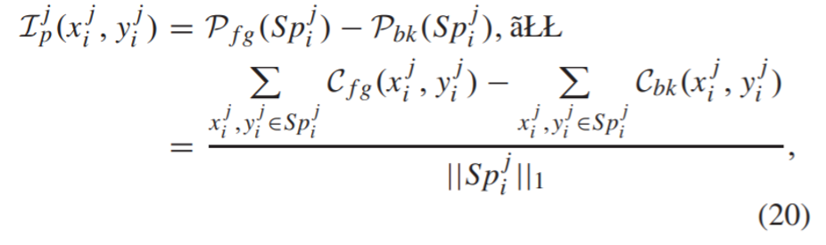

&emsp;&emsp;其中，Pfg(Spij) 和 Pbk(Spij) 是位于超像素 Spij 的前景和背景线索，(xij , yij ) 和 ||Spij||1  是超像素之间的位置和像素个数，Ijp(xij , yij ) 是特定层次上的邻近图像。

&emsp;&emsp;如前所述，多个层次捕获的超像素构成不同的邻近度图像，将邻近度图像的均值与前景分割的阈值 Tf 进行比较，如下所示：

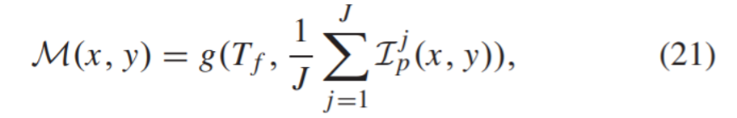

&emsp;&emsp;其中，M(x, y) 是运动物体的二进制掩码，J 是层数，g() 是式 11 中定义的分段函数。

&emsp;&emsp;不幸的是，在用单应性矩阵转换GMM模型的过程中，会积累对齐误差。为了解决这一问题，提出了一种强更新策略来处理误差的累积，它直接用当前帧的像素强度来代替 GMM模型的均值，强更新是在前景分割后完成的。在式 8 中，从具有最高权值的高斯函数的平均值 uk 中获取背景图像的强度，因此，在强更新过程中，权值最高的 uk 被对应像素的强度所代替。为了避免运动目标的影响，只对背景像素进行强更新，如下所示：

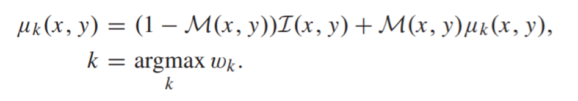

**总结：**

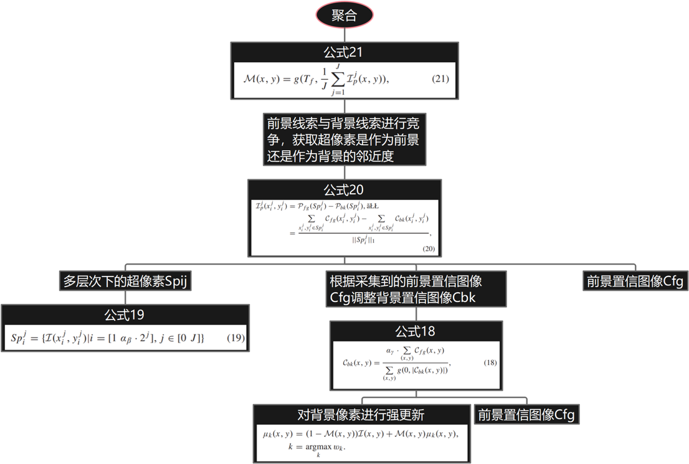

## **4.4 实验**

### **4.4.1 评估度量和数据集**

&emsp;&emsp;选择 FMBS 数据集作为评价 IFB 模型的基准，FBMS数据集是一个非常有挑战性的数据集，包含 59 个视频序列，摄像机的运动包括平移、旋转和缩放变换，其场景多样性也增加其复杂性。比较过程中，Re(Recall)， Pr(Precision) 和 Fm(F-measure) 指标用于评估，Re 和 Pr 分别是完整性和准确性的度量，Fm 是 Re 和 Pr 的结合，这些度量的定义如下：

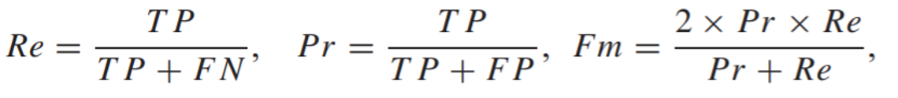

&emsp;&emsp;其中，TP 和 FP 是真正类和假正类，这里的正表示前景，而负表示背景，真表示这个检测的结果是正确的，而假表示相反。因此，TP 表示检测的结果是正确的前景。

### **4.4.2 前景和背景线索之间的排他性**

&emsp;&emsp;本节将讨论前景和背景线索之间的排他性，IFB 的效果来自于前景和背景线索之间的排他性，没有这种排他性，IFB 就不能准确地分割移动的物体。在 IFB 模型中，前景线索被用来产生一个粗略的前景，同时，显示场景背景部分的背景线索可以用来补偿前景线索的错误。为了证明这一点，我们设计了另一个背景线索被消除的 IFB 模型( IFBnobk )，并将 IFBnobk 与 IFB 模型进行比较，以证明背景线索的必要性。从 FBMS 数据集中选择了 6 个视频进行定量和定性比较。

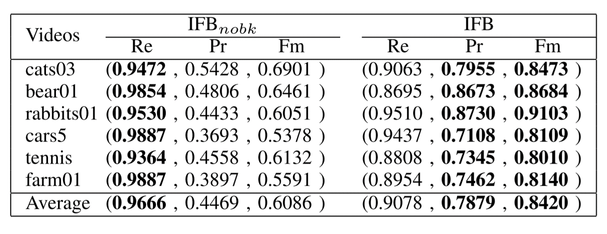

**分析：**

- IFB 模型的 Fm 评分高于没有背景提示的 IFB 模型，由于 Fm 度量是最重要的，所以有理由宣称 IFB 产生的前景比 IFBnobk 分割的前景更好。

- 此外，由于缺少背景线索，所有的前景线索，无论是对的还是错的，都被用于前景分割。因此，IFBnobk 分割的前景更加完整，Re 具有更高的分数。

- 但是，由于前景线索是粗糙线索，错误地检测到几个作为前景的背景部分，所以 IFBnobk 的 Pr 分数低于 IFB。

- 在 IFB 模型中，由于背景线索被用来弥补前景线索的缺陷，所以 IFB 在 Pr 指标上有了明显的改善，但在 Re 分数上有很小的牺牲。

- 最终，IFB 模型的 Fm 评分高于 IFBnobk ，背景线索的重要性也比较突出。

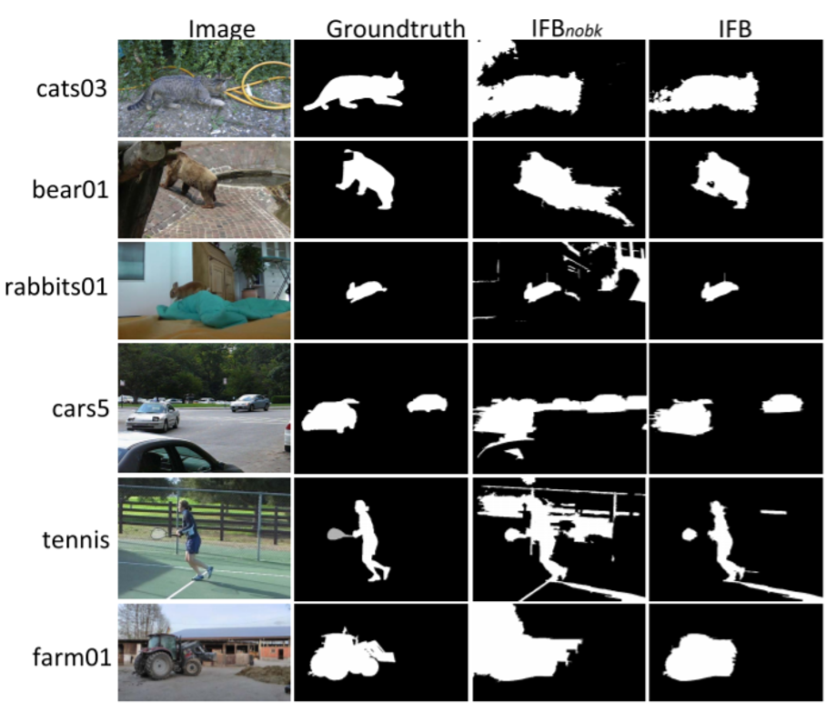

### **4.4.3 IFB 的定量评估**

&emsp;&emsp;将 IFB 模型与 FBMS 基准中的 GBSSP、calMoSeg、MLayer进行比较，这几类算法都是基于光流的，特别是 Mlayer 是基于大位移光流(LDOF)，这是一种著名的光流提取算法。

&emsp;&emsp;对于 IFB 模型，所有结果都是在与下表相同的参数下执行的。此外，IFBSU、IFBKA、IFBSI 的结果分别由 SURF、KAZE 和 SIFT 特征输入的 IFB 模型捕获。

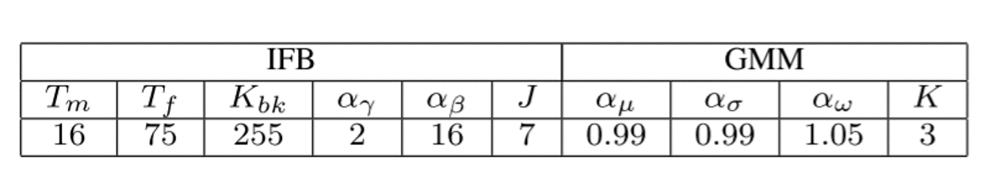

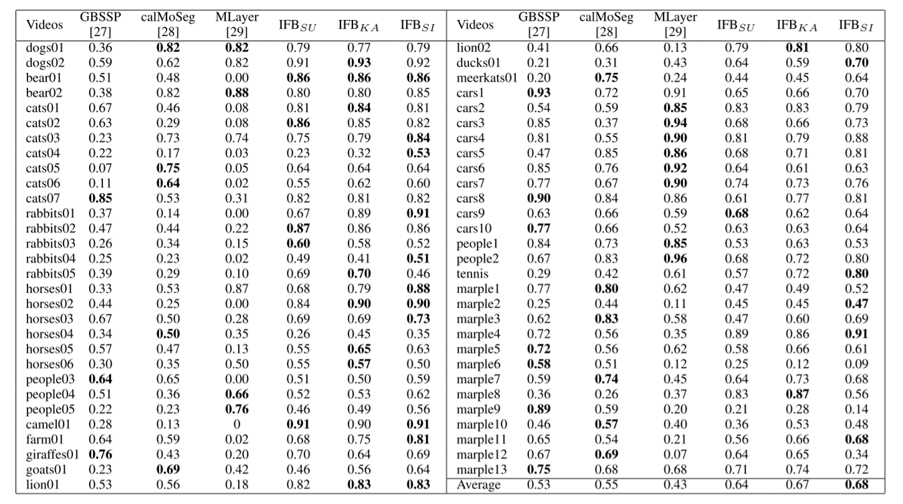

**分析：**

- 特别是在 camel01 视频序列中，GBSSP 和 calMoSeg 的 Fm 评分分别为 28% 和 13%，而MLayer 则完全失效。然而，在 IFB 模型中，扩展的 GMM 捕获前景线索进行整合，前景线索和背景线索的交替使用提高了前景分割的准确性。最后，IFB 模型的 Fm 分数达到 91%，远远高于其他算法。
- 在这些 FBMS 数据集的视频中，其中包含了 cars1-10、people1-2 和 marple1-13，几个视频的帧数是有限的。例如，cars1 视频仅包含19帧。在这种情况下，像 GMM 这样的统计模型没有足够的帧来产生足够用于聚合的前景线索，运动物体的大部分被识别为背景。因此，在没有足够的学习帧的情况下，GMM 模型获取的背景图像中包含了运动的物体，影响了背景线索的提取。前景和背景线索的失败导致了IFB模型在这些视频序列中的有限性能。实验证明，当视频至少包含40 帧时，IFB 模型工作良好。

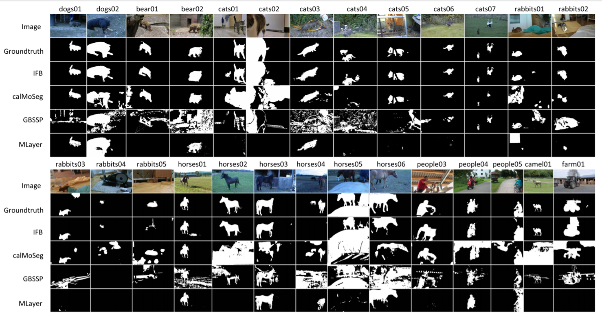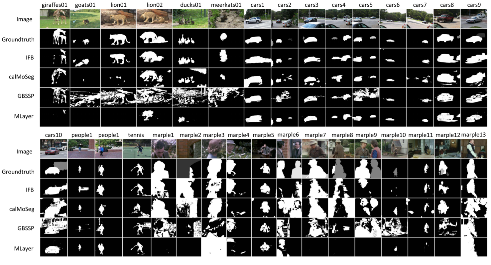

## **4.5 结论**

&emsp;&emsp;本研究提出了自由运动相机背景减法的 IFB 框架。以前的研究是试图提高运动估计的精度，而 IFB 致力于聚合可选的前景和背景线索来实现前景分割。  

&emsp;&emsp;通过背景运动估计的 GMM 模型来检测前景线索，而通过单应性变换从时空特征中获取背景线索，然后利用多层面的超像素来整合这些线索。同时，IFB 的效率来自于前景和背景线索之间的排他性，以及超像素在多个层次上的利用。

&emsp;&emsp;最后，通过综合实验验证了该方法在不同场景下的有效性，通过与其他先进方法的比较，证明了该框架的高效性，具有实际应用的潜力。