# 整体框架

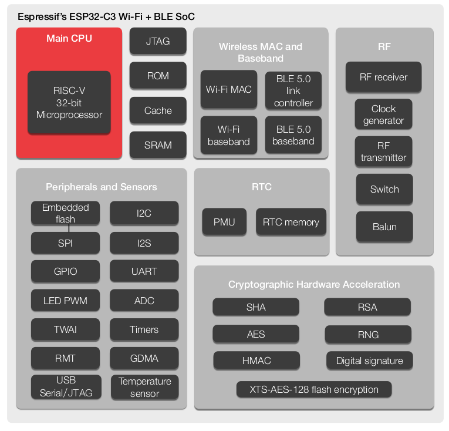

<!--more-->

# 芯片命名

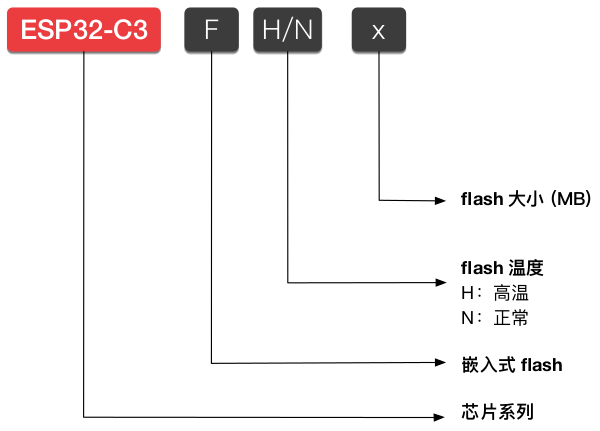

# Boot

- 共有 3 个 Strapping 管脚: **GPIO2**, **GPIO8**, **GPIO9**.
- 启动模式:
  
  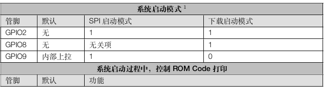
  
  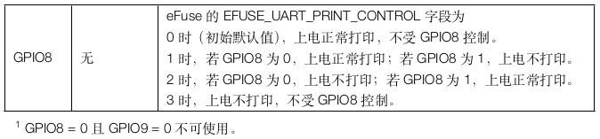

- **SPI Boot**:
  - 常规 flash 启动方式: 支持安全启动, 程序运行在 RAM 中.
  - 直接启动方式: 不支持安全启动, 程序直接运行在 flash 中. 
    
    如需使能这一启动方式, 确保下载至 flash 的 bin 文件其前两个字(地址:0x42000000)为 0xaebd041d

# CPU 地址分布

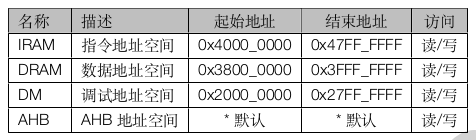

- IRAM、DRAM、DM 地址范围以外的地址空间通过 AHB 总线访问.

# 中断

- 中断向量:
  
  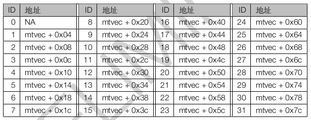

- 15 个优先级级别, 可以分配给不同的中断.

# GDMA

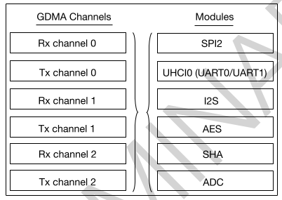

# 存储器

- 地址映射:
  
  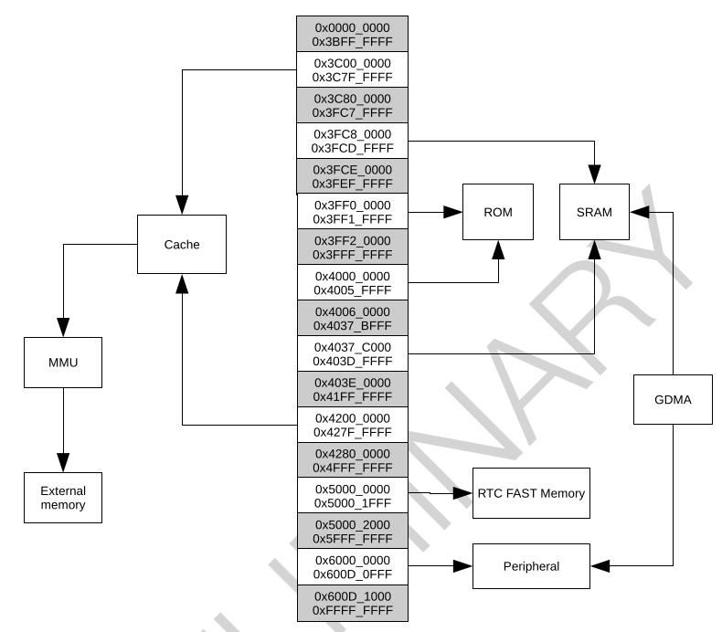
  
  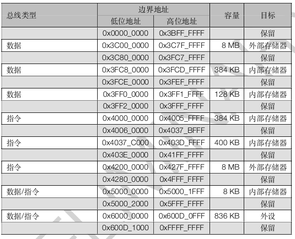
  
  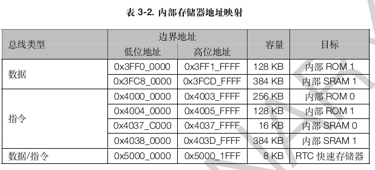
  
  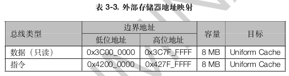

# 复位

- 复位等级
  
  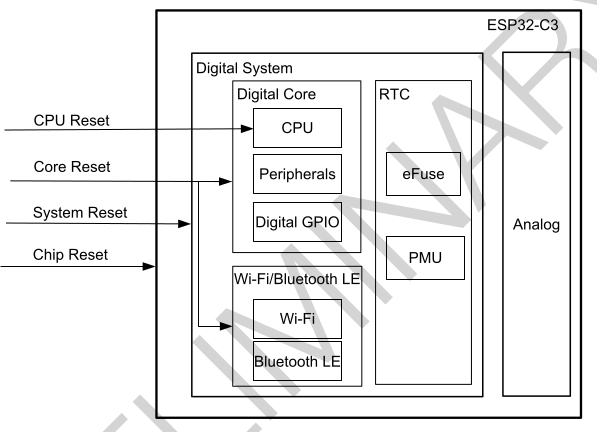

# 时钟

- 时钟树:
  
  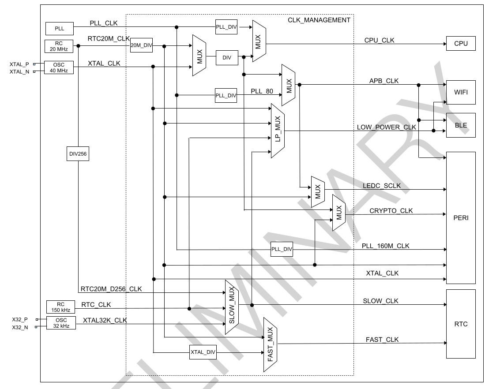
