# 整体框架

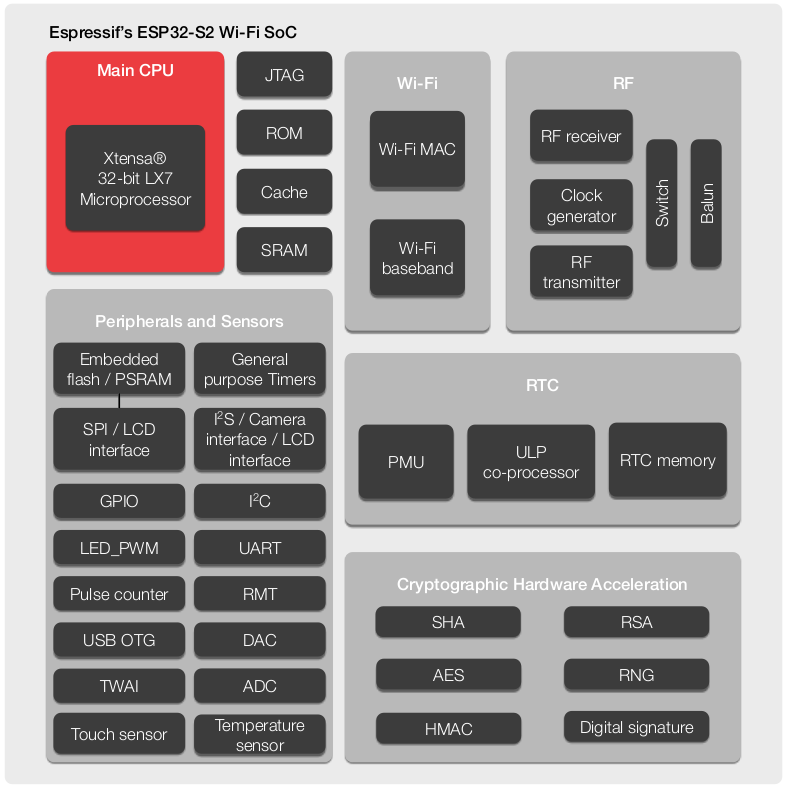

<!--more-->

# 芯片命名

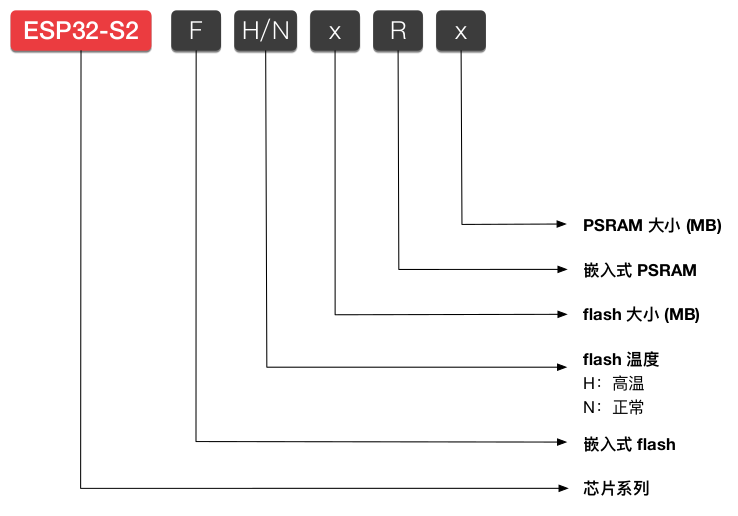

# 协处理器

- 架构:
  
  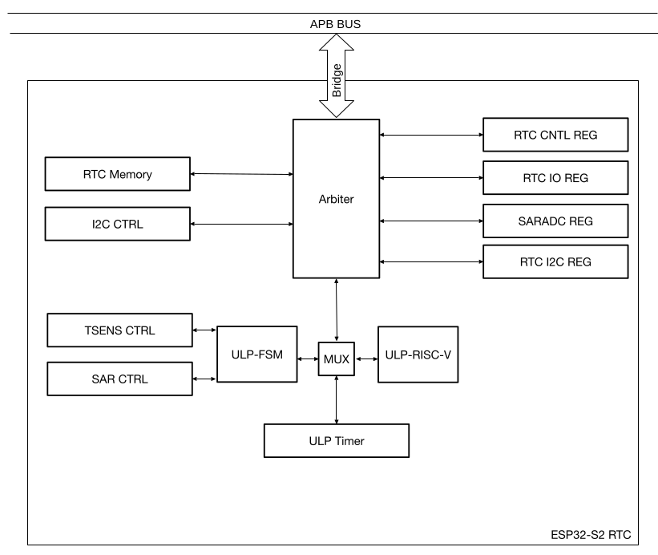
- **ULP-RISC-V** 支持用户使用 C 语言编写程序, 然后使用编译器将程序编译成 RV32IMC 标准指令码.
- **ULP-FSM** 不支持高级语言, 需使用 ULP-FSM 专门指令集进行编程.

# DMA

- 包括三种 DMA: **Internal DMA**, **EDMA** 和 **Copy DMA**.
  
  - **Internal DMA**: 只能访问片内 RAM, 用于内存与外设之间的数据传输.
  
  - **EDMA**: 既能访问片内 RAM 也能访问片外 RAM, 用于存储器与外设之间的数据传输.
  
  - **Copy DMA**: 只能访问片内 RAM, 用于内存与内存之间的高速数据传输.
- 支持的模块和传输类型:
  
  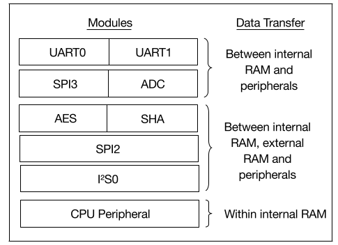
- 描述符的第三个 word 指示的地址只能在片内, 指向下一个可用描述符, 所有描述符都需存在内存中.

# 存储器

- 地址映射:
  
  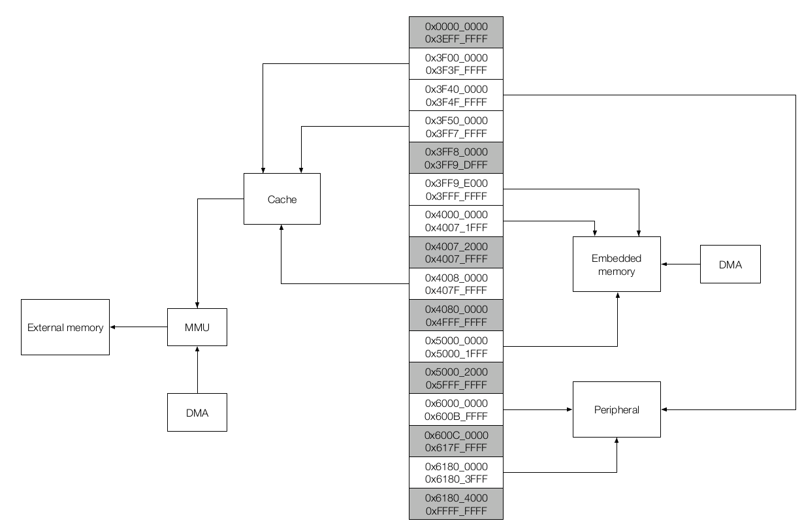
  
  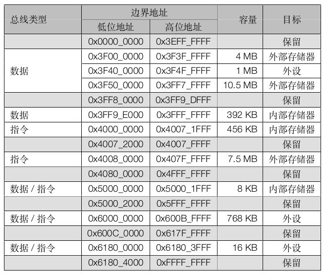
  
  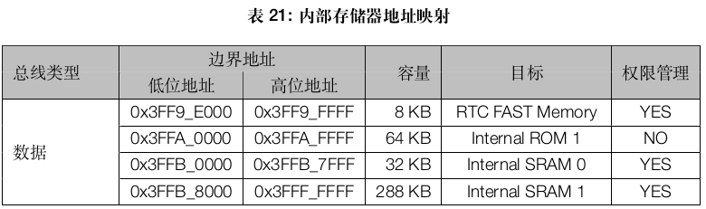
  
  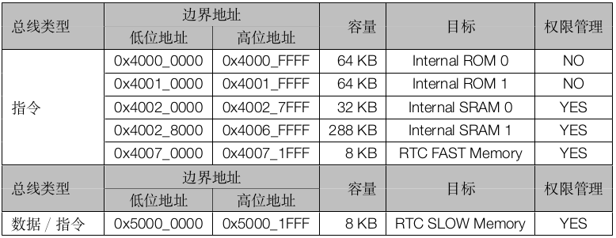
  
  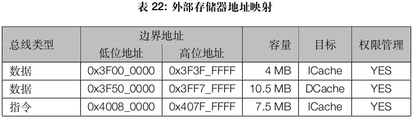
- 外设总线:
  
  - **PeriBus1**: 0x3F40_0000 ~ 0x3F4F_FFFF.
  
  - **PeriBus2**: 0x6000_0000 ~ 0x600B_FFFF, 0x6180_0000 ~ 0x6180_3FFF
  - 相比于 CPU 通过 **PeriBus2** 访问模块 / 外设, CPU 通过 **PeriBus1** 访问模块 / 外设效率更高. 
    
    但是 **PeriBus1** 有预测性读的特点, 不能保证每一次的读访问都是真实有效的.
    
    因此, 在访问模块 / 外设中的某些特殊寄存器如 FIFO 寄存器时, 必须使用 **PeriBus2** 进行访问.
  - **PeriBus1** 会打乱总线上的读写操作的先后顺序以提升性能, 这可能会导致对读写操作的先后顺序有严格要求的程序发生崩溃.
    
    对于这种情况, 在程序语句之前增加 ***volatile***, 也可以改用 **PeriBus2** 进行访问.
  - **PeriBus1** 访问受限地址列表:
    
    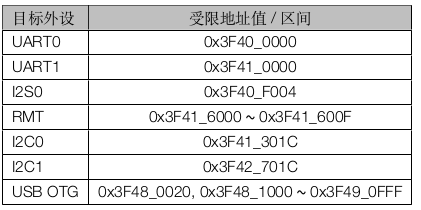

# 复位

- 复位等级:
  
  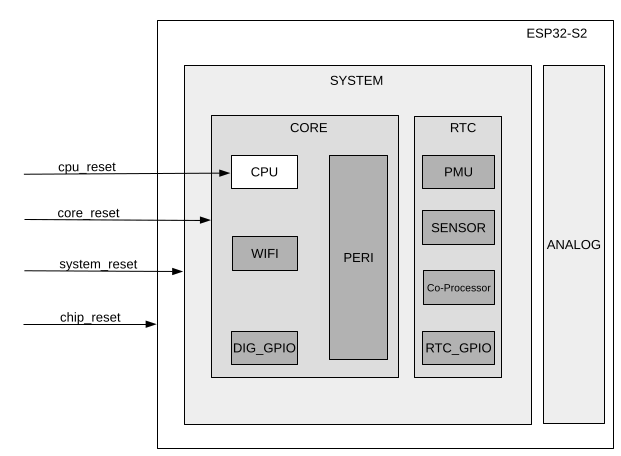
- 复位释放后, CPU 可以通过读取寄存器 **RTC_CNTL_RESET_CAUSE_PROCPU** 来获取复位源.

# 时钟

- 时钟树
  
  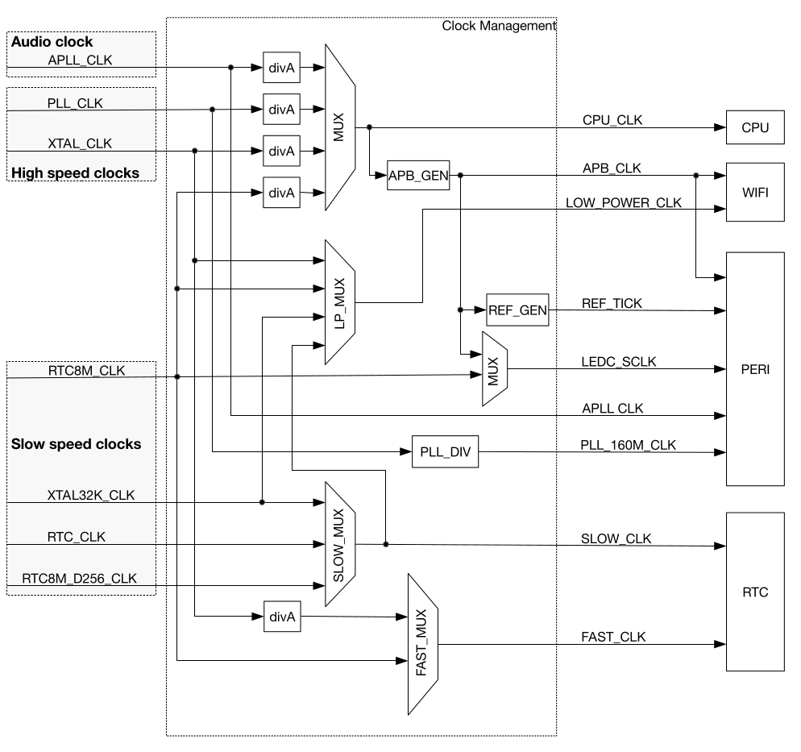
- 时钟源:
  - **PLL_CLK**: 320 MHz 或 480 MHz 内部 PLL 时钟.
  - **XTAL_CLK**: 40 MHz 外部晶振时钟.
  - **XTAL32K_CLK**: 32 kHz 外部晶振时钟.
  - **RTC8M_CLK**: 内置 8 MHz 振荡器的 N 分频时钟, 频率可调.
  - **RTC8M_D256_CLK**: 由 RTC8M_CLK 经 256 分频所得, 频率为 RTC8M_CLK / 256.
  - **RTC_CLK**: 90 kHz 内部低功耗时钟, 频率可调.
  - **APLL_CLK**: 16 MHz ~ 128 MHz 内部 Audio PLL 时钟.

# Boot

- Strapping 管脚: **GPIO0**(上拉)、**GPIO45**(下拉) 和 **GPIO46**(下拉).
- **启动模式**:
  
  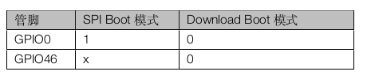
  
  在 **SPI Boot** 模式下, CPU 通过从 SPI Flash 中读取程序来启动系统.
  
  在 **Download Boot** 模式下, 用户可以通过 UART0、UART1、QPI 或 USB 接口将代码下载到 SRAM 或 Flash 中, 或者将程序加载到 SRAM 中并在 Download Boot 模式下执行程序.

- ROM Code 打印
  
  **GPIO46** 与 eFuse **UART_PRINT_CONTROL** 一起控制 ROM Code 打印.
  
  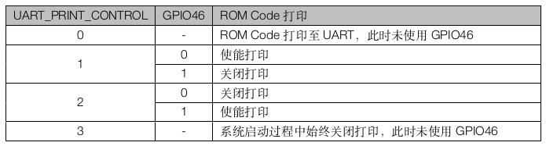
  
  ROM Code 上电打印默认通过 U0TXD 管脚, 可以由 eFuse UART_PRINT_CHANNEL (0: UART0; 1: DAC_1) 控制切换到 DAC_1 管脚.

# 中断

- 支持 6 级中断, 数字**越大**代表中断优先级**越高**.
  
  其中, NMI 拥有最高优先级, 一旦 NMI 中断发生,CPU 必定会响应.
- CPU 中断:
  
  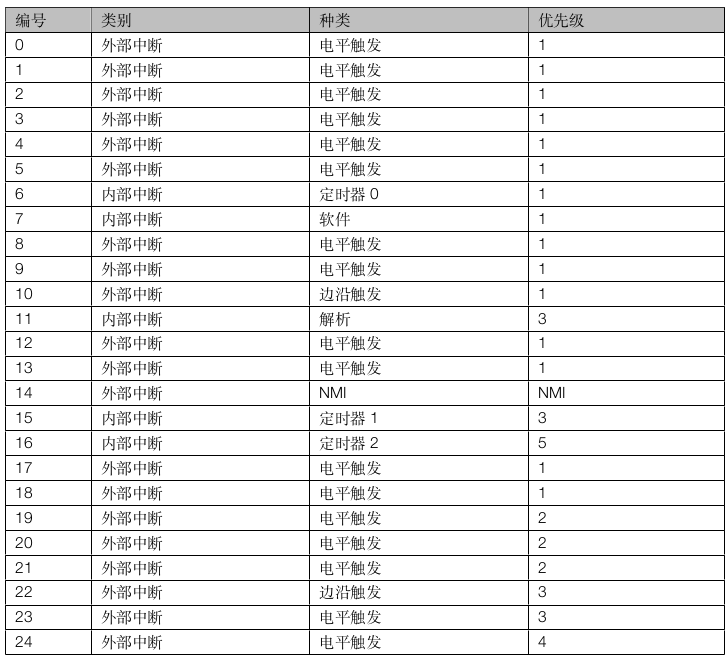
  
  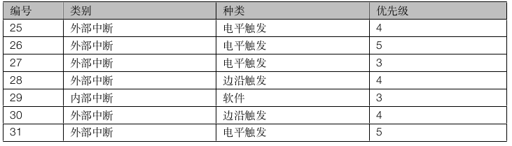
