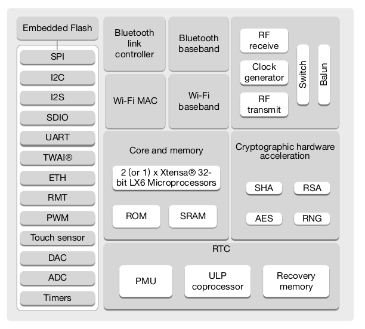
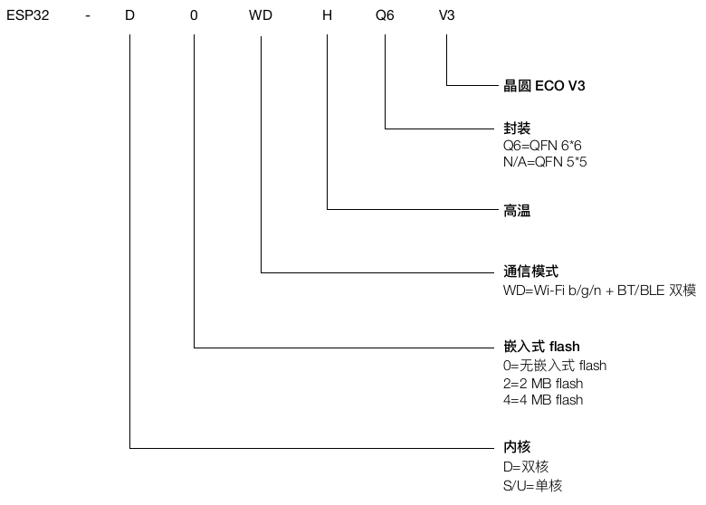
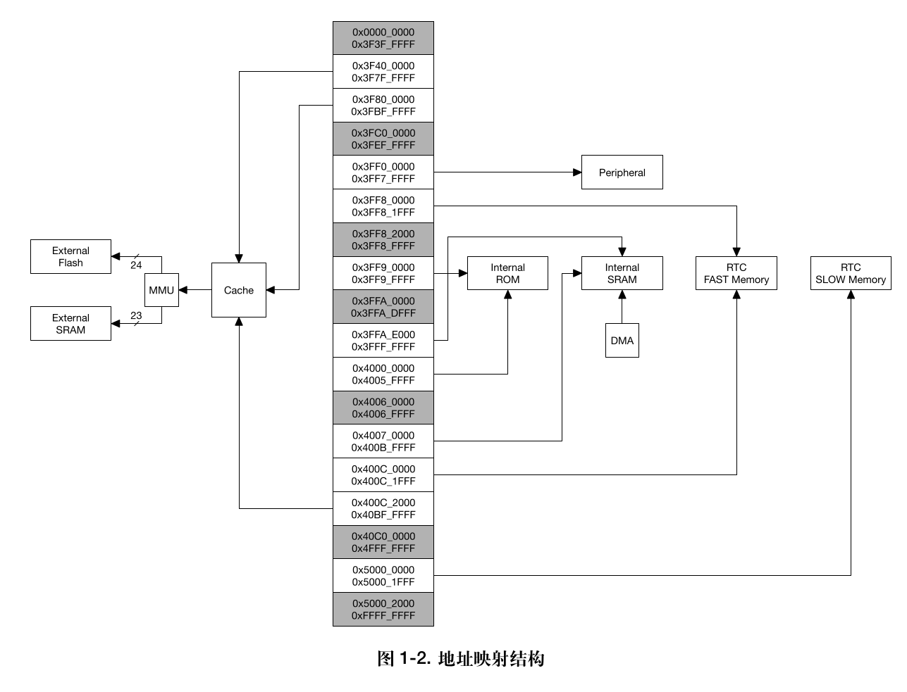
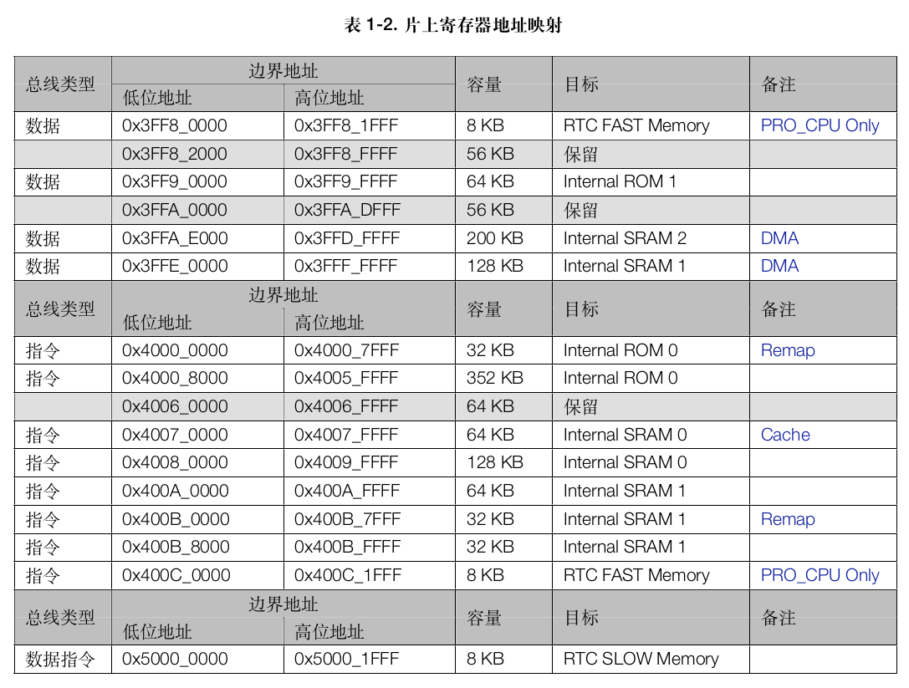
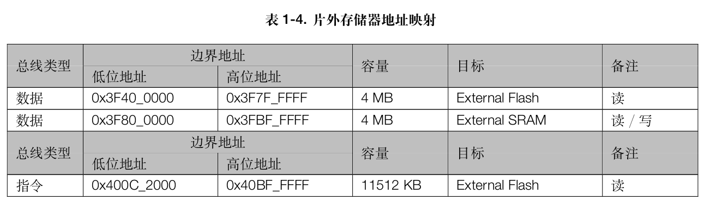
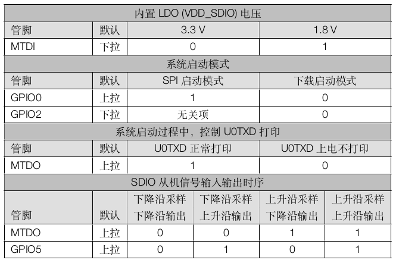
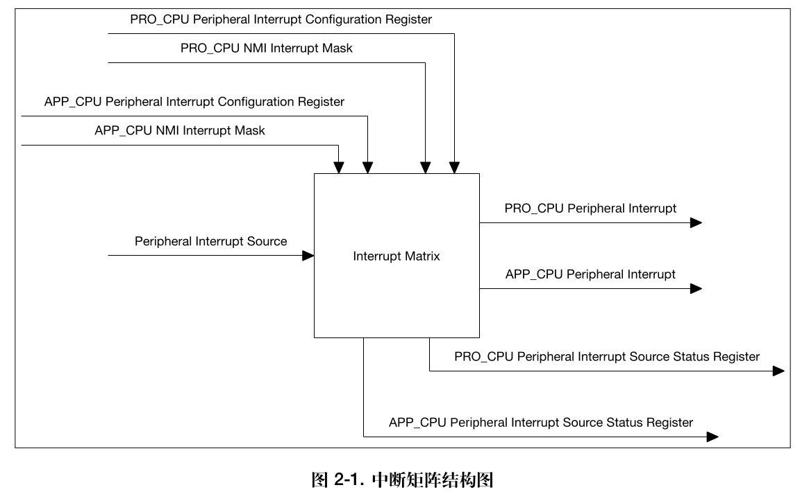
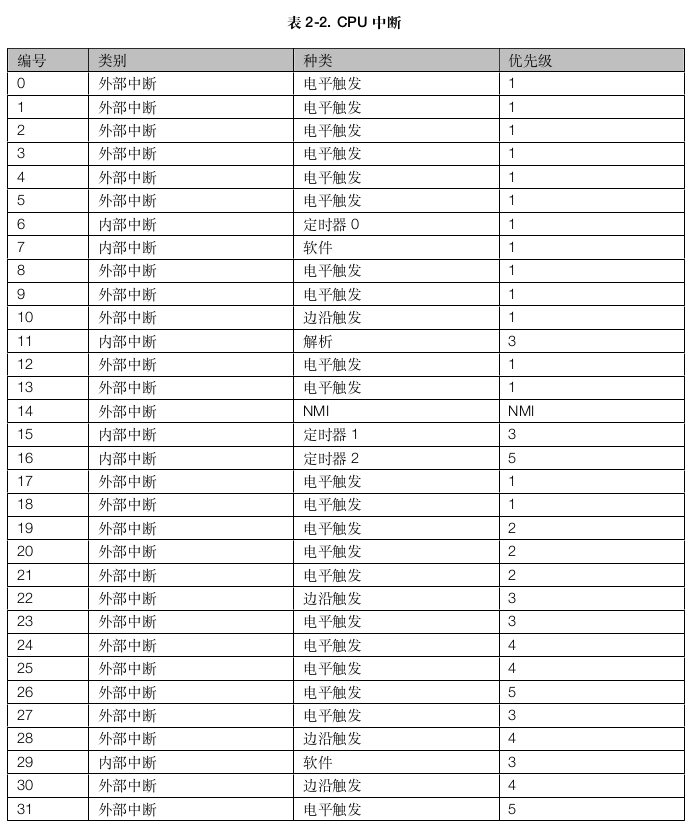
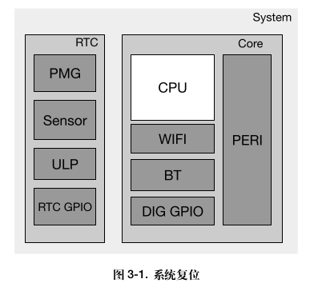
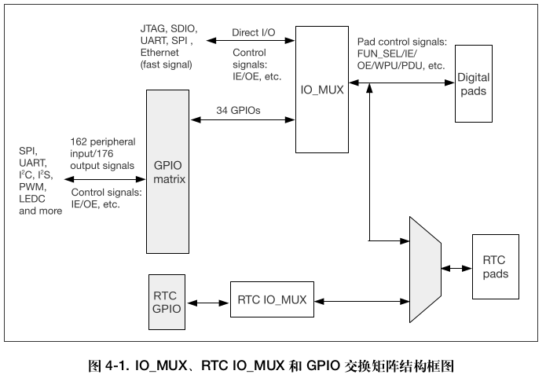

# 整体框架

<!--more-->

# 芯片命名

# 存储器

- RTC 存储器为 SRAM.
- 地址映射:
  
  
  
  
  
  
- Internal SRAM1 通过**数据总线**和**指令总线**访问的字(32位)是**逆序**的, 如: 0x3FFE_0000 与 0x400B_FFFC 访问到相同的字.
- PRO_CPU 通过**数据总线**和**指令总线**访问 **RTC FAST Memory** 的字(32位)是同序的, 如: 0x3FF8_0000 与 0x400C_0000 访问到相同的字.
- 开启 Cache 功能后, **POOL0** 或者 **POOL1** 只作为 cache memory 使用,不能复用作为**指令总线**的访问区域.
- 每个 CPU 访问的 **PID Controller** 是独立的(APP_CPU 和 PRO_CPU 访问该外设同一地址的数据不同).
- 外设中只有 **SDIO Slave** 的地址空间不连续.
- 使用 (0x3FF40000 + n) 地址和使用 (0x60000000 + n) 地址访问的内容是相同的,其中 n = 0 ~ 0x3FFFF.
- 相比于通过 AHB 访问外设, CPU 通过 DPORT 访问外设效率更高. 但是 DPORT 有预测性读 (speculative read) 的特点,不能保证每一次的读访问都是真实有效的. 另外,DPORT 会打乱总线上的读写操作的先后顺序以提升性能, 这可能会导致对读写操作的先后顺序有严格要求的程序发生崩溃. 此外使用 AHB 总线读 FIFO 会出现无法预知的错误.

# Boot

- 共有 5 个 Strapping 管脚: **MTDI**, **GPIO0**, **GPIO2**, **MTDO**, **GPIO5**.
- 启动模式:
  
  

# 中断

- 中断结构:
  
  
- 输入为 **71** 个外部中断源, 输出给每个 CPU 各自 **26** 个外部中断(共 **52** 个).
- 71 个中断源中, **GPIO_INTERRUPT_PRO** 和 **GPIO_INTERRUPT_PRO_NMI** 只可以分配给 **PRO_CPU**, **GPIO_INTERRUPT_APP** 和 **GPIO_INTERRUPT_APP_NMI** 只可以分配给 **APP_CPU**.
- 两个 CPU(PRO_CPU 和 APP_CPU)各有 **32** 个中断, 其中 **26** 个为**外部中断**, **6** 个为**内部中断**.
- 中断优先级:
  
  
- 能够暂时屏蔽所有被分配到 CPU 的外部中断源的 **NMI** 中断信号.

# 复位

- 复位影响范围:
  
  
- **PRO_CPU** 可以通过读取寄存器 **RTC_CNTL_RESET_CAUSE_PROCPU** 来获取复位源, **APP_CPU** 则可以通过读取寄存器 **RTC_CNTL_RESET_CAUSE_APPCPU** 来获取复位源.

# 时钟

- 时钟源
  - **PLL_CLK**, 320 MHz 或 480 MHz 内部 PLL 时钟
  - **XTL_CLK**, 2 ~ 40 MHz 外部晶振时钟
  - **XTL32K_CLK**, 32 KHz 外部晶振时钟
  - **RTC8M_CLK**, 8 MHz 内部时钟, 频率可调
  - **RTC8M_D256_CLK** 由 RTC8M_CLK 经 256 分频所得, 频率为(RTC8M_CLK/256). 当 RTC8M_CLK 的初始频率为 8 MHz 时, 该时钟以 31.250 KHz 的频率运行
  - **RTC_CLK**, 150 KHz 内部低功耗时钟, 频率可调
  - **APLL_CLK**, 16 ~ 128 MHz 内部 Audio PLL 时钟
- 时钟信号
  - CPU 时钟.
  - 外设时钟: `APB_CLK`, `REF_TICK`, `LEDC_SCLK`, `APLL_CLK` 和 `PLL_D2_CLK`.
- Wi-Fi 和 BT 必须在 APB_CLK 时钟源选择 PLL_CLK 下才能工作.

# GPIO

- 34 个 物理 GPIO pad: 0­-19, 21-­23, 25-­27, 32­-39. 其中 34-39 仅用作**输入**.
- 每个 pad 可以配置成 **GPIO 功能**或者**直连功能**.
- 162 个**外设输入信号**都可以选择任意一个 GPIO pad 的输入信号, 每个 GPIO pad 的输出信号可来自 176 个**外设输出信号**中的任意一个.
- 同一个输入 pad 上可以同时绑定多个内部输入信号, 某一个外设的输出信号可以同时从多个 pad 输出.
- 每个 IO pad(包括 RTC pad)都有单独的 hold 功能.

 # DPort

系统通过 DPort 寄存器中的配置寄存器对各个模块进行配置.

- **APP_CPU** 从 ROM code 启动之后, 会跳转到 **DPORT_APPCPU_BOOT_ADDR** 寄存器中的地址.

# DMA

- ESP32 中有 13 个外设都具有 DMA 功能, 这 13 个外设是: UARTn, SPIn, I2Sn、SDIO slave, SD/MMC host, EMAC, BT 和 Wi-Fi.
