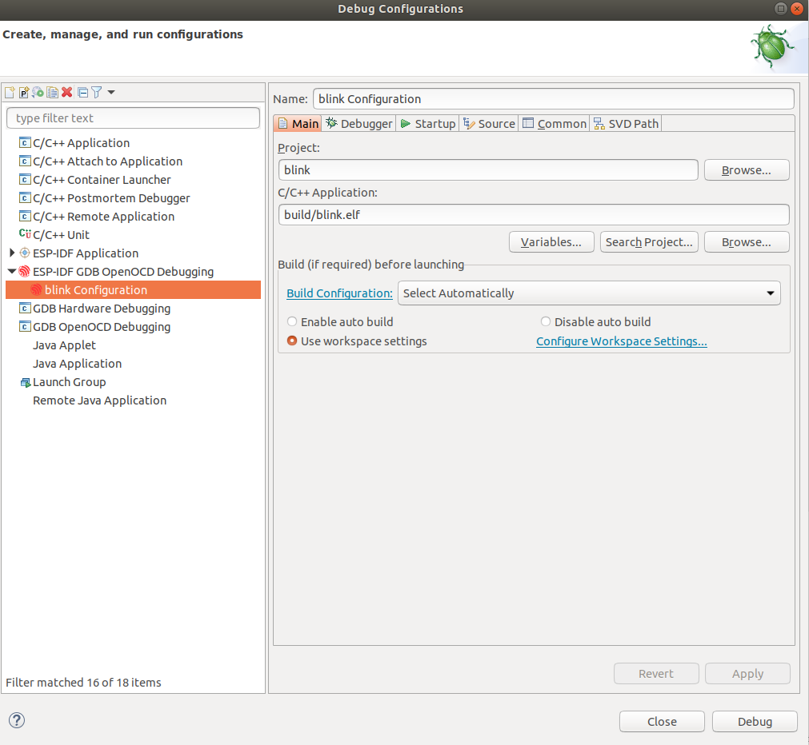

# 环境

- Ubuntu 18.04.5 LTS / Windows 7
- Eclipse 2021-03
- ESP32-S2-Kaluga-Kit

<!--more-->

# IDE 安装

[下载](https://www.eclipse.org/downloads/download.php?file=/technology/epp/downloads/release/2021-03/R/eclipse-cpp-2021-03-R-linux-gtk-x86_64.tar.gz)解压后目录里有可执行文件 `eclipse`, 可以直接运行而无需安装 (注意是 **for C/C++** 版本 ).

# IDF 环境搭建

按照 [espressif/idf-eclipse-plugin](https://github.com/espressif/idf-eclipse-plugin#esp-idf-eclipse-plugin) 中 **Installing ESP-IDF** 和 **Installing ESP-IDF Tools** 两节进行.

## Windows
<span style="color:red">通过[文档](https://docs.espressif.com/projects/esp-idf/zh_CN/latest/esp32s2/get-started/index.html#get-started-set-up-env)中"第四步:设置环境变量", 可能无法将 ESP-IDF 工具的路径加入系统环境变量 **PATH**, 所以需要人为确认是否成功设置了环境变量. 如果设置失败, 可以手动将命令执行窗口中输出的路径添加到 **PATH** 中.</span>

# 新建工程

按照 [espressif/idf-eclipse-plugin](https://github.com/espressif/idf-eclipse-plugin#esp-idf-eclipse-plugin) 中 **Create a new Project** 节进行.

# 编译&烧录程序

按照 [espressif/idf-eclipse-plugin](https://github.com/espressif/idf-eclipse-plugin#esp-idf-eclipse-plugin) 中 **Configuring Launch target**, **Compiling the Project**, **Flashing the Project** 三节进行.

- 烧录程序点击 **Run** 按钮即可.

# 调试

## openocd

### Ubuntu

连接开发板后, 查看 USB 端口, 若用户组为 **dialout**, 如:

```powershell
user-name@computer-name:~/esp$ ls -l /dev/ttyUSB*
crw-rw---- 1 root dialout 188, 0 Jul 10 19:04 /dev/ttyUSB0
crw-rw---- 1 root dialout 188, 1 Jul 10 19:04 /dev/ttyUSB1
```

则需要进行如下操作 (详情见文档 [[1]](https://sourceforge.net/p/openocd/code/ci/master/tree/README) 和 [[2]](https://forgge.github.io/theCore/guides/running-openocd-without-sudo.html) ):

- 添加当前用户到 ***plugdev*** 用户组
  ```powershell
  sudo usermod -a -G plugdev $(whoami)
  ```
- 创建  /etc/udev/rules.d/99-openocd.rules 文件
  ```powershell
  sudo vim /etc/udev/rules.d/99-openocd.rules
  ```

  内容如下:

  ```powershell
  # Copy this file to /etc/udev/rules.d/
  
  ACTION!="add|change", GOTO="openocd_rules_end"
  SUBSYSTEM!="usb|tty|hidraw", GOTO="openocd_rules_end"
  
  # Please keep this list sorted by VID:PID
  
  # opendous and estick
  ATTRS{idVendor}=="03eb", ATTRS{idProduct}=="204f", MODE="664", GROUP="plugdev"
  
  # Original FT232/FT245 VID:PID
  ATTRS{idVendor}=="0403", ATTRS{idProduct}=="6001", MODE="664", GROUP="plugdev"
  
  # Original FT2232 VID:PID
  ATTRS{idVendor}=="0403", ATTRS{idProduct}=="6010", MODE="664", GROUP="plugdev"
  
  # Original FT4232 VID:PID
  ATTRS{idVendor}=="0403", ATTRS{idProduct}=="6011", MODE="664", GROUP="plugdev"
  
  # Original FT232H VID:PID
  ATTRS{idVendor}=="0403", ATTRS{idProduct}=="6014", MODE="664", GROUP="plugdev"
  
  # DISTORTEC JTAG-lock-pick Tiny 2
  ATTRS{idVendor}=="0403", ATTRS{idProduct}=="8220", MODE="664", GROUP="plugdev"
  
  # TUMPA, TUMPA Lite
  ATTRS{idVendor}=="0403", ATTRS{idProduct}=="8a98", MODE="664", GROUP="plugdev"
  ATTRS{idVendor}=="0403", ATTRS{idProduct}=="8a99", MODE="664", GROUP="plugdev"
  
  # XDS100v2
  ATTRS{idVendor}=="0403", ATTRS{idProduct}=="a6d0", MODE="664", GROUP="plugdev"
  
  # Xverve Signalyzer Tool (DT-USB-ST), Signalyzer LITE (DT-USB-SLITE)
  ATTRS{idVendor}=="0403", ATTRS{idProduct}=="bca0", MODE="664", GROUP="plugdev"
  ATTRS{idVendor}=="0403", ATTRS{idProduct}=="bca1", MODE="664", GROUP="plugdev"
  
  # TI/Luminary Stellaris Evaluation Board FTDI (several)
  ATTRS{idVendor}=="0403", ATTRS{idProduct}=="bcd9", MODE="664", GROUP="plugdev"
  
  # TI/Luminary Stellaris In-Circuit Debug Interface FTDI (ICDI) Board
  ATTRS{idVendor}=="0403", ATTRS{idProduct}=="bcda", MODE="664", GROUP="plugdev"
  
  # egnite Turtelizer 2
  ATTRS{idVendor}=="0403", ATTRS{idProduct}=="bdc8", MODE="664", GROUP="plugdev"
  
  # Section5 ICEbear
  ATTRS{idVendor}=="0403", ATTRS{idProduct}=="c140", MODE="664", GROUP="plugdev"
  ATTRS{idVendor}=="0403", ATTRS{idProduct}=="c141", MODE="664", GROUP="plugdev"
  
  # Amontec JTAGkey and JTAGkey-tiny
  ATTRS{idVendor}=="0403", ATTRS{idProduct}=="cff8", MODE="664", GROUP="plugdev"
  
  # TI ICDI
  ATTRS{idVendor}=="0451", ATTRS{idProduct}=="c32a", MODE="664", GROUP="plugdev"
  
  # STLink v1
  ATTRS{idVendor}=="0483", ATTRS{idProduct}=="3744", MODE="664", GROUP="plugdev"
  
  # STLink v2
  ATTRS{idVendor}=="0483", ATTRS{idProduct}=="3748", MODE="664", GROUP="plugdev"
  
  # STLink v2-1
  ATTRS{idVendor}=="0483", ATTRS{idProduct}=="374b", MODE="664", GROUP="plugdev"
  
  # Hilscher NXHX Boards
  ATTRS{idVendor}=="0640", ATTRS{idProduct}=="0028", MODE="664", GROUP="plugdev"
  
  # Hitex STR9-comStick
  ATTRS{idVendor}=="0640", ATTRS{idProduct}=="002c", MODE="664", GROUP="plugdev"
  
  # Hitex STM32-PerformanceStick
  ATTRS{idVendor}=="0640", ATTRS{idProduct}=="002d", MODE="664", GROUP="plugdev"
  
  # Amontec JTAGkey-HiSpeed
  ATTRS{idVendor}=="0fbb", ATTRS{idProduct}=="1000", MODE="664", GROUP="plugdev"
  
  # IAR J-Link USB
  ATTRS{idVendor}=="1366", ATTRS{idProduct}=="0101", MODE="664", GROUP="plugdev"
  ATTRS{idVendor}=="1366", ATTRS{idProduct}=="0102", MODE="664", GROUP="plugdev"
  ATTRS{idVendor}=="1366", ATTRS{idProduct}=="0103", MODE="664", GROUP="plugdev"
  ATTRS{idVendor}=="1366", ATTRS{idProduct}=="0104", MODE="664", GROUP="plugdev"
  
  # J-Link-OB (onboard)
  ATTRS{idVendor}=="1366", ATTRS{idProduct}=="0105", MODE="664", GROUP="plugdev"
  
  # Raisonance RLink
  ATTRS{idVendor}=="138e", ATTRS{idProduct}=="9000", MODE="664", GROUP="plugdev"
  
  # Debug Board for Neo1973
  ATTRS{idVendor}=="1457", ATTRS{idProduct}=="5118", MODE="664", GROUP="plugdev"
  
  # Olimex ARM-USB-OCD
  ATTRS{idVendor}=="15ba", ATTRS{idProduct}=="0003", MODE="664", GROUP="plugdev"
  
  # Olimex ARM-USB-OCD-TINY
  ATTRS{idVendor}=="15ba", ATTRS{idProduct}=="0004", MODE="664", GROUP="plugdev"
  
  # Olimex ARM-JTAG-EW
  ATTRS{idVendor}=="15ba", ATTRS{idProduct}=="001e", MODE="664", GROUP="plugdev"
  
  # Olimex ARM-USB-OCD-TINY-H
  ATTRS{idVendor}=="15ba", ATTRS{idProduct}=="002a", MODE="664", GROUP="plugdev"
  
  # Olimex ARM-USB-OCD-H
  ATTRS{idVendor}=="15ba", ATTRS{idProduct}=="002b", MODE="664", GROUP="plugdev"
  
  # USBprog with OpenOCD firmware
  ATTRS{idVendor}=="1781", ATTRS{idProduct}=="0c63", MODE="664", GROUP="plugdev"
  
  # TI/Luminary Stellaris In-Circuit Debug Interface (ICDI) Board
  ATTRS{idVendor}=="1cbe", ATTRS{idProduct}=="00fd", MODE="664", GROUP="plugdev"
  
  # Marvell Sheevaplug
  ATTRS{idVendor}=="9e88", ATTRS{idProduct}=="9e8f", MODE="664", GROUP="plugdev"
  
  # CMSIS-DAP compatible adapters
  ATTRS{product}=="*CMSIS-DAP*", MODE="664", GROUP="plugdev"
  
  LABEL="openocd_rules_end"
  ```
- 重启 `udev`
  ```powershell
  sudo udevadm trigger
  sudo reboot
  ```

### Windows

- 要按照[文档](https://docs.espressif.com/projects/esp-idf/zh_CN/latest/esp32s2/api-guides/jtag-debugging/configure-ft2232h-jtag.html)配置驱动, 否则运行 `openocd -f board/esp32s2-kaluga-1.cfg` 可能会报错, 如下:
  ```
  For bug reports, read
          http://openocd.org/doc/doxygen/bugs.html
  Info : Listening on port 6666 for tcl connections
  Info : Listening on port 4444 for telnet connections
  Error: libusb_open() failed with LIBUSB_ERROR_NOT_FOUND
  Error: no device found
  Error: unable to open ftdi device with vid 0403, pid 6010, description '*', serial '*' at bus location '*'
  Error: no device found
  Error: unable to open ftdi device with vid 0403, pid 6014, description '*', serial '*' at bus location '*'
  
  Assertion failed!
  ```

- <span style="color:red">本环境下安装 v2.12.36 版本驱动存在问题, 安装 v2.12.28 版本正常.</span>

## 使用 "GDB Hardware Debugging" 调试

- 无需下载, IDE 自带
- 按照文档中"[使用 Eclipse 调试](https://docs.espressif.com/projects/esp-idf/zh_CN/latest/esp32s2/api-guides/jtag-debugging/using-debugger.html#jtag-debugging-using-debugger-eclipse)"进行配置, 调试前需要在终端开启 **openocd**.

### Ubuntu

- 如果直接使用 **VSCode** 插件下载的 **ESP-IDF**, 可能会出现 gdb 超时的问题, 可以通过 **Eclipse** 插件重新下载 **ESP-IDF** 来解决.<span style="color:red"> 除此之外, 可以使用下一节的方法进行调试.</span>

### Windows

- <span style="color:red">点击调试按钮没有反应, 暂未解决.</span>

## 使用 "ESP-IDF GDB OpenOCD Debugging" 调试

- 更加方便和通用的方法
- 点击工具栏 **Run** -> **Debug Configurations**,   新建 ***ESP-IDF GDB OpenOCD Debugging*** 文件.



### Ubuntu

- 所有信息自动配置完成, 需要注意的是 **Debugger** -> ***OpenOCD Setup*** -> ***Config options*** 文本框中内容, 要保证其中的 **.cfg** 文件参数与目标开发板保持一致, 如:
  ```
  # 下列参数对应于 ESP32-S2-Kaluga 开发板
  -s ${openocd_path}/share/openocd/scripts -f interface/ftdi/esp32s2_kaluga_v1.cfg -f board/esp32s2-kaluga-1.cfg
  ```

- 配置完成后点击 ***Debug*** 可直接调试, 无需在终端打开 **openocd**.

### Windows

- 所有信息自动配置完成, 但是默认使用了 Linux 下的环境变量, 所以需要修改命令为实际路径.
- <span style="color:red">开启调试会报错, 暂未解决.</span>
  ```
  Error in final launch sequence
  Failed to execute MI command:
  -target-select remote localhost:3333
  Error message from debugger back end:
  Remote communication error.  Target disconnected.: Success.
  Failed to execute MI command:
  -target-select remote localhost:3333
  Error message from debugger back end:
  Remote communication error.  Target disconnected.: Success.
  Remote communication error.  Target disconnected.: Success.
  ```
